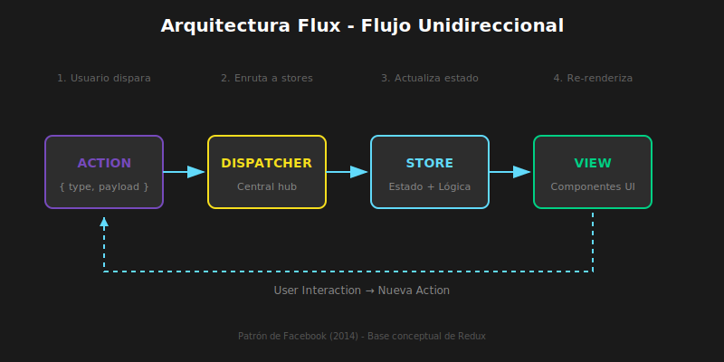
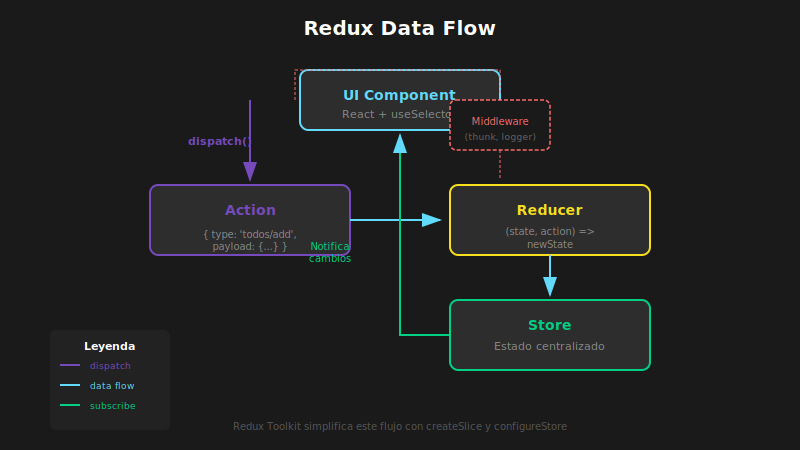

# 📖 Arquitectura Flux y Principios de Redux

## 🎯 Objetivos de Aprendizaje

- Comprender la arquitectura Flux y su flujo unidireccional
- Entender los tres principios fundamentales de Redux
- Conocer el ciclo de vida de una acción en Redux
- Identificar cuándo usar Redux vs otras soluciones

---

## 1. El Problema del Estado en Aplicaciones Grandes

### 1.1 Estado Compartido Caótico

En aplicaciones grandes, el estado puede volverse caótico con múltiples fuentes de verdad, actualizaciones impredecibles y debugging difícil.

### 1.2 La Solución: Flujo Unidireccional

El flujo unidireccional resuelve estos problemas:



**Beneficios del flujo unidireccional:**

- ✅ Una sola fuente de verdad
- ✅ Cambios predecibles
- ✅ Fácil debugging
- ✅ Estado consistente

---

## 2. Arquitectura Flux

Facebook creó Flux para resolver problemas de estado en sus aplicaciones.

### 2.1 Componentes de Flux

El diagrama anterior muestra el flujo completo de la arquitectura Flux.

**Componentes:**

1. **Action**: Objeto que describe QUÉ pasó
2. **Dispatcher**: Distribuye las acciones a los stores
3. **Store**: Contiene el estado y la lógica de negocio
4. **View**: Interfaz de usuario (React)

---

## 3. Los Tres Principios de Redux

Redux es una implementación refinada de Flux con tres principios fundamentales.

### 3.1 Una Única Fuente de Verdad

```typescript
// ✅ PRINCIPIO 1: Single Source of Truth
// Todo el estado de la aplicación está en un único store

interface RootState {
  users: UserState;
  products: ProductState;
  cart: CartState;
  ui: UIState;
}

// Un solo objeto contiene TODO el estado
const store = configureStore({
  reducer: {
    users: usersReducer,
    products: productsReducer,
    cart: cartReducer,
    ui: uiReducer,
  },
});
```

**Beneficios:**

- Estado fácil de inspeccionar
- Debugging simplificado
- Serialización para persistencia
- Server-side rendering posible

### 3.2 El Estado es de Solo Lectura

```typescript
// ✅ PRINCIPIO 2: State is Read-Only
// La única forma de cambiar el estado es emitiendo una acción

// ❌ MAL - Modificar directamente
state.user.name = 'Nuevo Nombre';

// ✅ BIEN - Dispatch de una acción
store.dispatch({
  type: 'user/updateName',
  payload: 'Nuevo Nombre',
});

// ✅ BIEN - Con action creator
store.dispatch(updateUserName('Nuevo Nombre'));
```

**Beneficios:**

- Cambios centralizados y rastreables
- Historial de acciones (time-travel)
- Previene mutaciones accidentales

### 3.3 Cambios con Funciones Puras

```typescript
// ✅ PRINCIPIO 3: Changes with Pure Functions
// Los reducers son funciones puras: (state, action) => newState

// Un reducer SIEMPRE:
// - Retorna el mismo output para el mismo input
// - No tiene efectos secundarios
// - No muta el estado original

// ❌ MAL - Impuro (muta el estado)
function badReducer(state, action) {
  state.items.push(action.payload); // ¡Mutación!
  return state;
}

// ✅ BIEN - Puro (retorna nuevo estado)
function goodReducer(state, action) {
  return {
    ...state,
    items: [...state.items, action.payload],
  };
}

// ✅ MEJOR - Con Immer (Redux Toolkit lo incluye)
// Parece mutación pero crea nuevo estado internamente
const slice = createSlice({
  name: 'items',
  initialState: { items: [] },
  reducers: {
    addItem: (state, action) => {
      state.items.push(action.payload); // ¡OK con Immer!
    },
  },
});
```

---

## 4. El Ciclo de Vida de Redux

### 4.1 Flujo Completo



**Pasos del ciclo:**

1. Usuario interactúa con la UI
2. Componente llama `dispatch(action)`
3. Store recibe la acción
4. Reducer calcula nuevo estado `(state, action) => newState`
5. Store notifica a suscriptores
6. `useSelector` detecta cambios
7. Componentes se re-renderizan con nuevo estado

### 4.2 Ejemplo Concreto

```typescript
// 1. El usuario hace click en "Agregar al carrito"

// 2. El componente dispatcha una acción
const handleAddToCart = () => {
  dispatch(addToCart({ productId: 123, quantity: 1 }));
};

// 3. La acción llega al store
// { type: 'cart/addToCart', payload: { productId: 123, quantity: 1 } }

// 4. El reducer procesa la acción
const cartReducer = (state, action) => {
  switch (action.type) {
    case 'cart/addToCart':
      return {
        ...state,
        items: [...state.items, action.payload],
      };
    default:
      return state;
  }
};

// 5-7. El store actualiza y los componentes se re-renderizan
const CartBadge = () => {
  const itemCount = useSelector((state) => state.cart.items.length);
  return <span>{itemCount}</span>; // Se actualiza automáticamente
};
```

---

## 5. Conceptos Clave de Redux

### 5.1 Actions (Acciones)

```typescript
// QUÉ: Objeto que describe qué sucedió
// PARA: Comunicar intención de cambiar el estado
// IMPACTO: Es la ÚNICA forma de modificar el store

// Acción básica
const action = {
  type: 'todos/add',
  payload: { id: 1, text: 'Aprender Redux', completed: false },
};

// Con TypeScript (Redux Toolkit)
interface Todo {
  id: number;
  text: string;
  completed: boolean;
}

// El tipo se infiere automáticamente de PayloadAction
```

### 5.2 Reducers

```typescript
// QUÉ: Función pura que calcula el nuevo estado
// PARA: Especificar CÓMO cambia el estado en respuesta a acciones
// IMPACTO: Determina la lógica de actualización del estado

// Firma de un reducer
type Reducer<S, A> = (state: S, action: A) => S;

// Ejemplo tipado
interface CounterState {
  value: number;
}

const counterReducer = (
  state: CounterState = { value: 0 },
  action: { type: string; payload?: number },
): CounterState => {
  switch (action.type) {
    case 'counter/increment':
      return { value: state.value + 1 };
    case 'counter/decrement':
      return { value: state.value - 1 };
    case 'counter/incrementByAmount':
      return { value: state.value + (action.payload ?? 0) };
    default:
      return state;
  }
};
```

### 5.3 Store

```typescript
// QUÉ: Objeto que contiene el estado de la aplicación
// PARA: Centralizar el estado y coordinar actualizaciones
// IMPACTO: Única fuente de verdad para toda la app

import { configureStore } from '@reduxjs/toolkit';

const store = configureStore({
  reducer: {
    counter: counterReducer,
    todos: todosReducer,
  },
});

// Métodos del store
store.getState(); // Obtener estado actual
store.dispatch(action); // Enviar acción
store.subscribe(fn); // Escuchar cambios
```

### 5.4 Dispatch

```typescript
// QUÉ: Función que envía acciones al store
// PARA: Disparar cambios de estado
// IMPACTO: Inicia el ciclo de actualización

// Dispatch básico
store.dispatch({ type: 'counter/increment' });

// Con action creator
store.dispatch(increment());

// En componentes React
import { useDispatch } from 'react-redux';

const Counter = () => {
  const dispatch = useDispatch();

  return (
    <button onClick={() => dispatch(increment())}>
      Incrementar
    </button>
  );
};
```

### 5.5 Selectors

```typescript
// QUÉ: Funciones que extraen datos del estado
// PARA: Encapsular la estructura del estado y optimizar renders
// IMPACTO: Componentes independientes de la forma del estado

// Selector básico
const selectCount = (state: RootState) => state.counter.value;

// Uso en componente
const Counter = () => {
  const count = useSelector(selectCount);
  return <span>{count}</span>;
};

// Selector con cálculo
const selectTotalPrice = (state: RootState) =>
  state.cart.items.reduce((sum, item) => sum + item.price * item.quantity, 0);
```

---

## 6. Redux vs Otras Soluciones

### 6.1 Cuándo Usar Redux

✅ **Usa Redux cuando:**

- App grande con estado complejo compartido
- Necesitas historial de acciones (debugging, undo/redo)
- Múltiples desarrolladores trabajan en el estado
- Necesitas middleware extenso (sagas, observables)
- El estado cambia frecuentemente de formas complejas

❌ **NO uses Redux cuando:**

- App pequeña o mediana con estado simple
- El estado es mayormente local de componentes
- Prototipado rápido
- El equipo no conoce Redux

### 6.2 Comparativa

| Característica | useState     | Context                  | Zustand       | Redux Toolkit   |
| -------------- | ------------ | ------------------------ | ------------- | --------------- |
| Complejidad    | Muy baja     | Baja                     | Baja          | Media           |
| Boilerplate    | Ninguno      | Bajo                     | Mínimo        | Medio           |
| DevTools       | React        | React                    | Plugin        | Excelentes      |
| Escalabilidad  | Local        | Media                    | Buena         | Excelente       |
| Middleware     | No           | No                       | Sí            | Muy rico        |
| Comunidad      | -            | -                        | Creciente     | Muy grande      |
| Caso ideal     | Estado local | Estado compartido simple | Apps medianas | Apps enterprise |

---

## 7. Redux Toolkit: El Estándar Moderno

Redux Toolkit (RTK) es la forma recomendada de usar Redux hoy.

### 7.1 Por Qué Redux Toolkit

```typescript
// ❌ Redux clásico - Mucho boilerplate
// actions.ts
const ADD_TODO = 'ADD_TODO';
const addTodo = (text) => ({ type: ADD_TODO, payload: text });

// reducer.ts
const initialState = { todos: [] };
const todosReducer = (state = initialState, action) => {
  switch (action.type) {
    case ADD_TODO:
      return { ...state, todos: [...state.todos, action.payload] };
    default:
      return state;
  }
};

// ✅ Redux Toolkit - Conciso y tipado
const todosSlice = createSlice({
  name: 'todos',
  initialState: { todos: [] as Todo[] },
  reducers: {
    addTodo: (state, action: PayloadAction<string>) => {
      state.todos.push({
        id: Date.now(),
        text: action.payload,
        completed: false,
      });
    },
  },
});

export const { addTodo } = todosSlice.actions;
export default todosSlice.reducer;
```

### 7.2 Beneficios de RTK

| Redux Clásico               | Redux Toolkit             |
| --------------------------- | ------------------------- |
| Configuración manual        | `configureStore()`        |
| Constantes de acción        | Generadas automáticamente |
| Inmutabilidad manual        | Immer integrado           |
| DevTools manual             | Incluido por defecto      |
| Thunks requieren middleware | `createAsyncThunk`        |
| Normalización manual        | `createEntityAdapter`     |

---

## 📝 Resumen

1. **Flux** es una arquitectura con flujo unidireccional de datos
2. **Redux** implementa Flux con tres principios:
   - Una única fuente de verdad
   - Estado de solo lectura
   - Cambios con funciones puras
3. El ciclo: **Action → Dispatch → Reducer → State → UI**
4. **Redux Toolkit** es el estándar moderno que reduce el boilerplate
5. Usa Redux para apps grandes; considera Zustand para apps medianas

---

## 🔗 Recursos

- [Redux Fundamentals](https://redux.js.org/tutorials/fundamentals/part-1-overview)
- [Redux Toolkit Quick Start](https://redux-toolkit.js.org/tutorials/quick-start)
- [Flux Architecture](https://facebook.github.io/flux/docs/in-depth-overview/)

---

[← Volver a Teoría](../README.md) | [Siguiente: Configuración RTK →](02-configuracion-redux-toolkit.md)
