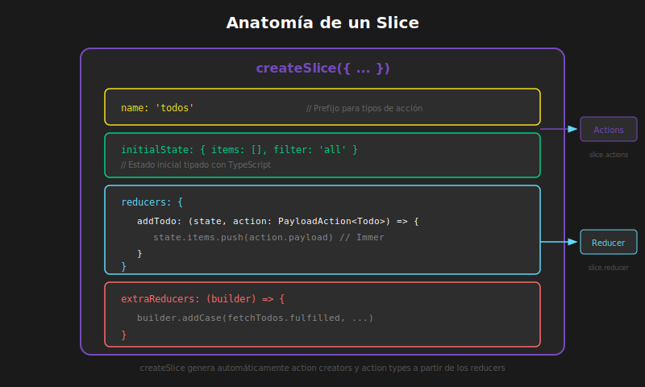

# 📖 Configuración de Redux Toolkit

## 🎯 Objetivos de Aprendizaje

- Instalar y configurar Redux Toolkit en un proyecto React
- Crear y configurar el store con `configureStore`
- Establecer tipos TypeScript para el store
- Configurar el Provider y hooks tipados
- Integrar Redux DevTools

---

## 1. Instalación

### 1.1 Dependencias Necesarias

```bash
# Instalación con pnpm
pnpm add @reduxjs/toolkit react-redux

# Los tipos están incluidos en @reduxjs/toolkit
# NO necesitas instalar @types adicionales
```

### 1.2 Estructura de Carpetas Recomendada

```
src/
├── app/
│   ├── store.ts          # Configuración del store
│   └── hooks.ts          # Hooks tipados (useAppDispatch, useAppSelector)
├── features/
│   ├── counter/
│   │   └── counterSlice.ts
│   ├── todos/
│   │   └── todosSlice.ts
│   └── user/
│       └── userSlice.ts
├── components/
│   └── ...
└── main.tsx
```

---

## 2. Crear el Store

### 2.1 Configuración Básica

```typescript
// src/app/store.ts

import { configureStore } from '@reduxjs/toolkit';
// Importaremos los reducers a medida que los creemos
// import counterReducer from '../features/counter/counterSlice';

// QUÉ: configureStore crea el store de Redux
// PARA: Centralizar todo el estado de la aplicación
// IMPACTO: Incluye Redux DevTools y middleware por defecto
export const store = configureStore({
  reducer: {
    // Aquí agregaremos los reducers
    // counter: counterReducer,
  },
});

// QUÉ: Inferir tipos del store
// PARA: Obtener tipado automático en toda la aplicación
// IMPACTO: TypeScript conoce la forma exacta del estado

// Tipo del estado raíz (inferido del store)
export type RootState = ReturnType<typeof store.getState>;

// Tipo del dispatch (incluye tipos de thunks)
export type AppDispatch = typeof store.dispatch;
```

### 2.2 Configuración con Opciones Avanzadas

```typescript
// src/app/store.ts

import { configureStore } from '@reduxjs/toolkit';
import counterReducer from '../features/counter/counterSlice';
import todosReducer from '../features/todos/todosSlice';
import userReducer from '../features/user/userSlice';

export const store = configureStore({
  reducer: {
    counter: counterReducer,
    todos: todosReducer,
    user: userReducer,
  },

  // Middleware adicional (opcional)
  middleware: (getDefaultMiddleware) =>
    getDefaultMiddleware({
      // Configuración del middleware de serialización
      serializableCheck: {
        // Ignorar ciertas acciones si es necesario
        ignoredActions: ['some/action'],
      },
    }),

  // DevTools habilitado por defecto en desarrollo
  devTools: process.env.NODE_ENV !== 'production',

  // Estado inicial precargado (opcional)
  // preloadedState: loadStateFromStorage(),
});

export type RootState = ReturnType<typeof store.getState>;
export type AppDispatch = typeof store.dispatch;
```

---

## 3. Hooks Tipados

### 3.1 Crear Hooks Personalizados

```typescript
// src/app/hooks.ts

import { useDispatch, useSelector } from 'react-redux';
import type { TypedUseSelectorHook } from 'react-redux';
import type { RootState, AppDispatch } from './store';

// QUÉ: Hook de dispatch tipado
// PARA: Dispatch con soporte completo de tipos (incluyendo thunks)
// IMPACTO: Evita errores de tipo al usar dispatch
export const useAppDispatch: () => AppDispatch = useDispatch;

// QUÉ: Hook de selector tipado
// PARA: Selectors con conocimiento del tipo de RootState
// IMPACTO: Autocompletado y validación de tipos en selectores
export const useAppSelector: TypedUseSelectorHook<RootState> = useSelector;
```

### 3.2 ¿Por Qué Hooks Tipados?

```typescript
// ❌ SIN hooks tipados - Requiere anotar tipos manualmente
const Counter = () => {
  const dispatch = useDispatch();
  const count = useSelector((state: RootState) => state.counter.value);

  // dispatch no conoce el tipo de las acciones async
};

// ✅ CON hooks tipados - Tipos inferidos automáticamente
const Counter = () => {
  const dispatch = useAppDispatch();
  const count = useAppSelector((state) => state.counter.value);
  //                            ↑ state tiene tipo RootState automáticamente

  // dispatch conoce todos los tipos de acciones incluyendo thunks
};
```

---

## 4. Configurar el Provider

### 4.1 Envolver la Aplicación

```typescript
// src/main.tsx

import React from 'react';
import ReactDOM from 'react-dom/client';
import { Provider } from 'react-redux';
import { store } from './app/store';
import App from './App';

// QUÉ: Provider hace el store disponible para toda la app
// PARA: Cualquier componente puede acceder al estado
// IMPACTO: Habilita useSelector y useDispatch en componentes hijos
ReactDOM.createRoot(document.getElementById('root')!).render(
  <React.StrictMode>
    <Provider store={store}>
      <App />
    </Provider>
  </React.StrictMode>
);
```

### 4.2 Diagrama de Arquitectura



El `Provider` envuelve toda la aplicación y hace que el store esté disponible para cualquier componente que use `useAppSelector` o `useAppDispatch`.

---

## 5. Crear un Slice Básico

### 5.1 Anatomía de un Slice

```typescript
// src/features/counter/counterSlice.ts

import { createSlice, PayloadAction } from '@reduxjs/toolkit';

// QUÉ: Interface del estado del slice
// PARA: Tipar el estado inicial y las actualizaciones
interface CounterState {
  value: number;
  status: 'idle' | 'loading' | 'failed';
}

// Estado inicial tipado
const initialState: CounterState = {
  value: 0,
  status: 'idle',
};

// QUÉ: createSlice genera actions y reducer automáticamente
// PARA: Reducir boilerplate y mantener lógica relacionada junta
// IMPACTO: Una sola fuente para estado, reducers y acciones
export const counterSlice = createSlice({
  name: 'counter', // Prefijo para los tipos de acción
  initialState,
  reducers: {
    // QUÉ: Reducer que incrementa el contador
    // Acción generada: { type: 'counter/increment' }
    increment: (state) => {
      // Immer permite "mutación" que produce nuevo estado
      state.value += 1;
    },

    // QUÉ: Reducer que decrementa el contador
    // Acción generada: { type: 'counter/decrement' }
    decrement: (state) => {
      state.value -= 1;
    },

    // QUÉ: Reducer con payload tipado
    // PayloadAction<number> define el tipo del payload
    // Acción generada: { type: 'counter/incrementByAmount', payload: number }
    incrementByAmount: (state, action: PayloadAction<number>) => {
      state.value += action.payload;
    },

    // QUÉ: Reducer que resetea el estado
    reset: (state) => {
      state.value = 0;
      state.status = 'idle';
    },
  },
});

// Exportar action creators generados automáticamente
export const { increment, decrement, incrementByAmount, reset } =
  counterSlice.actions;

// Exportar el reducer para agregarlo al store
export default counterSlice.reducer;
```

### 5.2 Agregar el Slice al Store

```typescript
// src/app/store.ts

import { configureStore } from '@reduxjs/toolkit';
import counterReducer from '../features/counter/counterSlice';

export const store = configureStore({
  reducer: {
    counter: counterReducer,
    // otros reducers...
  },
});

export type RootState = ReturnType<typeof store.getState>;
export type AppDispatch = typeof store.dispatch;
```

---

## 6. Usar el Slice en Componentes

### 6.1 Componente Contador

```typescript
// src/features/counter/Counter.tsx

import { useAppSelector, useAppDispatch } from '../../app/hooks';
import { increment, decrement, incrementByAmount, reset } from './counterSlice';

export const Counter: React.FC = () => {
  // QUÉ: Seleccionar valor del estado
  // El selector recibe RootState tipado automáticamente
  const count = useAppSelector((state) => state.counter.value);
  const status = useAppSelector((state) => state.counter.status);

  // QUÉ: Obtener dispatch tipado
  const dispatch = useAppDispatch();

  return (
    <div>
      <h2>Contador: {count}</h2>
      <p>Estado: {status}</p>

      <div>
        {/* Dispatch de acciones sin payload */}
        <button onClick={() => dispatch(decrement())}>-</button>
        <button onClick={() => dispatch(increment())}>+</button>

        {/* Dispatch de acción con payload */}
        <button onClick={() => dispatch(incrementByAmount(5))}>+5</button>

        {/* Reset */}
        <button onClick={() => dispatch(reset())}>Reset</button>
      </div>
    </div>
  );
};
```

---

## 7. Redux DevTools

### 7.1 Instalación de la Extensión

1. **Chrome**: [Redux DevTools Extension](https://chrome.google.com/webstore/detail/redux-devtools)
2. **Firefox**: [Redux DevTools Add-on](https://addons.mozilla.org/en-US/firefox/addon/reduxdevtools/)
3. **Edge**: Disponible en Microsoft Store

### 7.2 Características de DevTools

Redux DevTools proporciona una interfaz dividida en paneles:

- **Panel de Actions**: Lista todas las acciones despachadas (`counter/increment`, `counter/decrement`, etc.)
- **Panel de State**: Muestra el estado actual completo en formato JSON
- **Panel de Diff**: Muestra qué cambió entre el estado anterior y el nuevo
- **Controles**: Botones para Jump (saltar a un estado), Skip (omitir acción), etc.

**Funcionalidades:**

- 📝 **Lista de acciones**: Ver todas las acciones despachadas
- 🔍 **Inspección de estado**: Ver el estado actual completo
- ⏪ **Time-travel**: Saltar a cualquier punto del historial
- 📊 **Diff**: Ver qué cambió entre estados
- 💾 **Persistencia**: Exportar/importar estado
- 🔄 **Replay**: Reproducir secuencia de acciones

### 7.3 Configuración Avanzada de DevTools

```typescript
// src/app/store.ts

import { configureStore } from '@reduxjs/toolkit';

export const store = configureStore({
  reducer: {
    /* ... */
  },

  // Configuración de DevTools
  devTools: process.env.NODE_ENV !== 'production' && {
    // Nombre para identificar la instancia
    name: 'Mi App Redux',

    // Limitar historial de acciones
    maxAge: 50,

    // Trazar acciones (stack traces)
    trace: true,
    traceLimit: 25,

    // Serialización de acciones
    actionSanitizer: (action) => action,
    stateSanitizer: (state) => state,
  },
});
```

---

## 8. Middleware por Defecto

### 8.1 ¿Qué Incluye configureStore?

```typescript
// Redux Toolkit incluye automáticamente:

// 1. redux-thunk: Para acciones asíncronas
//    Permite dispatch de funciones además de objetos

// 2. Serializable State Invariant Middleware
//    Advierte si el estado contiene valores no serializables

// 3. Immutable State Invariant Middleware (solo desarrollo)
//    Advierte si se muta el estado directamente

// Equivalente a:
const store = createStore(
  rootReducer,
  applyMiddleware(
    thunk,
    serializableStateInvariantMiddleware,
    immutableStateInvariantMiddleware,
  ),
);
```

### 8.2 Personalizar Middleware

```typescript
import { configureStore } from '@reduxjs/toolkit';
import logger from 'redux-logger';

export const store = configureStore({
  reducer: {
    /* ... */
  },

  middleware: (getDefaultMiddleware) =>
    getDefaultMiddleware()
      // Agregar middleware adicional
      .concat(logger)
      // O prepend para que ejecute primero
      .prepend(myCustomMiddleware),
});
```

---

## 9. Configuración Completa de Ejemplo

```typescript
// src/app/store.ts

import { configureStore } from '@reduxjs/toolkit';
import counterReducer from '../features/counter/counterSlice';
import todosReducer from '../features/todos/todosSlice';
import userReducer from '../features/user/userSlice';

export const store = configureStore({
  reducer: {
    counter: counterReducer,
    todos: todosReducer,
    user: userReducer,
  },
  devTools: process.env.NODE_ENV !== 'production',
});

export type RootState = ReturnType<typeof store.getState>;
export type AppDispatch = typeof store.dispatch;
```

```typescript
// src/app/hooks.ts

import { useDispatch, useSelector } from 'react-redux';
import type { TypedUseSelectorHook } from 'react-redux';
import type { RootState, AppDispatch } from './store';

export const useAppDispatch: () => AppDispatch = useDispatch;
export const useAppSelector: TypedUseSelectorHook<RootState> = useSelector;
```

```typescript
// src/main.tsx

import React from 'react';
import ReactDOM from 'react-dom/client';
import { Provider } from 'react-redux';
import { store } from './app/store';
import App from './App';

ReactDOM.createRoot(document.getElementById('root')!).render(
  <React.StrictMode>
    <Provider store={store}>
      <App />
    </Provider>
  </React.StrictMode>
);
```

---

## 📝 Resumen

1. **Instalar** con `pnpm add @reduxjs/toolkit react-redux`
2. **Crear store** con `configureStore()` - incluye DevTools y middleware
3. **Exportar tipos** `RootState` y `AppDispatch` del store
4. **Crear hooks tipados** `useAppSelector` y `useAppDispatch`
5. **Envolver app** con `<Provider store={store}>`
6. **Usar DevTools** para debugging avanzado

---

## 🔗 Recursos

- [Redux Toolkit Quick Start](https://redux-toolkit.js.org/tutorials/quick-start)
- [Usage with TypeScript](https://redux-toolkit.js.org/usage/usage-with-typescript)
- [Configuring the Store](https://redux-toolkit.js.org/api/configureStore)

---

[← Anterior: Arquitectura Flux](01-arquitectura-flux-redux.md) | [Siguiente: Slices y Reducers →](03-slices-y-reducers.md)
