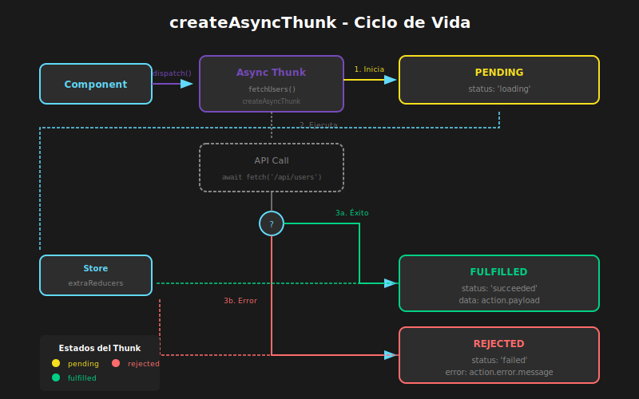

# 📖 Async Thunks con Redux Toolkit

## 🎯 Objetivos de Aprendizaje

- Crear operaciones asíncronas con `createAsyncThunk`
- Manejar estados de carga (pending, fulfilled, rejected)
- Tipar correctamente thunks con TypeScript
- Implementar patrones comunes de manejo de errores
- Cancelar y encadenar operaciones async

---

## Visualización del Flujo Async



---

## 1. ¿Qué es un Thunk?

### 1.1 Concepto de Thunk

```typescript
// QUÉ: Un "thunk" es una función que retorna otra función
// PARA: Ejecutar lógica async y despachar múltiples acciones
// IMPACTO: Permite side effects en Redux de forma controlada

// Thunk básico (manual)
const fetchUserThunk = (userId: string) => {
  // Esta función es el "thunk"
  return async (dispatch: AppDispatch, getState: () => RootState) => {
    dispatch(fetchUserStart());
    try {
      const response = await fetch(`/api/users/${userId}`);
      const user = await response.json();
      dispatch(fetchUserSuccess(user));
    } catch (error) {
      dispatch(fetchUserFailure(error.message));
    }
  };
};

// Uso
dispatch(fetchUserThunk('user-123'));
```

### 1.2 El Problema sin createAsyncThunk

```typescript
// ❌ SIN createAsyncThunk - Mucho boilerplate

// 1. Definir tipos de acción manualmente
const FETCH_USERS_START = 'users/fetchStart';
const FETCH_USERS_SUCCESS = 'users/fetchSuccess';
const FETCH_USERS_FAILURE = 'users/fetchFailure';

// 2. Crear action creators manualmente
const fetchUsersStart = () => ({ type: FETCH_USERS_START });
const fetchUsersSuccess = (users: User[]) => ({
  type: FETCH_USERS_SUCCESS,
  payload: users,
});
const fetchUsersFailure = (error: string) => ({
  type: FETCH_USERS_FAILURE,
  payload: error,
});

// 3. Crear el thunk manualmente
const fetchUsers = () => async (dispatch: Dispatch) => {
  dispatch(fetchUsersStart());
  try {
    const response = await fetch('/api/users');
    const users = await response.json();
    dispatch(fetchUsersSuccess(users));
  } catch (error) {
    dispatch(fetchUsersFailure(error.message));
  }
};

// 4. Manejar en el reducer manualmente
const usersReducer = (state = initialState, action: AnyAction) => {
  switch (action.type) {
    case FETCH_USERS_START:
      return { ...state, loading: true, error: null };
    case FETCH_USERS_SUCCESS:
      return { ...state, loading: false, users: action.payload };
    case FETCH_USERS_FAILURE:
      return { ...state, loading: false, error: action.payload };
    default:
      return state;
  }
};
```

---

## 2. createAsyncThunk

### 2.1 Sintaxis Básica

```typescript
import { createAsyncThunk, createSlice } from '@reduxjs/toolkit';

// QUÉ: createAsyncThunk genera un thunk con 3 acciones automáticas
// PARA: Simplificar operaciones async con estados de carga
// IMPACTO: pending, fulfilled, rejected se generan automáticamente

export const fetchUsers = createAsyncThunk(
  'users/fetchAll', // Prefijo para los tipos de acción
  async () => {
    const response = await fetch('/api/users');
    return response.json();
  },
);

// Acciones generadas automáticamente:
// - users/fetchAll/pending   → Cuando inicia
// - users/fetchAll/fulfilled → Cuando tiene éxito
// - users/fetchAll/rejected  → Cuando hay error
```

### 2.2 Ejemplo Completo con Tipos

```typescript
// src/features/users/usersSlice.ts

import { createSlice, createAsyncThunk, PayloadAction } from '@reduxjs/toolkit';
import type { RootState } from '../../app/store';

// ============================================
// TIPOS
// ============================================

interface User {
  id: string;
  name: string;
  email: string;
  avatar: string;
}

interface UsersState {
  items: User[];
  selectedUser: User | null;
  status: 'idle' | 'loading' | 'succeeded' | 'failed';
  error: string | null;
}

// ============================================
// ESTADO INICIAL
// ============================================

const initialState: UsersState = {
  items: [],
  selectedUser: null,
  status: 'idle',
  error: null,
};

// ============================================
// ASYNC THUNKS
// ============================================

// Fetch todos los usuarios
export const fetchUsers = createAsyncThunk('users/fetchAll', async () => {
  const response = await fetch('https://jsonplaceholder.typicode.com/users');

  if (!response.ok) {
    throw new Error('Error al cargar usuarios');
  }

  const data: User[] = await response.json();
  return data;
});

// Fetch un usuario por ID
export const fetchUserById = createAsyncThunk(
  'users/fetchById',
  async (userId: string) => {
    const response = await fetch(
      `https://jsonplaceholder.typicode.com/users/${userId}`,
    );

    if (!response.ok) {
      throw new Error('Usuario no encontrado');
    }

    const data: User = await response.json();
    return data;
  },
);

// Crear usuario
export const createUser = createAsyncThunk(
  'users/create',
  async (userData: Omit<User, 'id'>) => {
    const response = await fetch('https://jsonplaceholder.typicode.com/users', {
      method: 'POST',
      headers: { 'Content-Type': 'application/json' },
      body: JSON.stringify(userData),
    });

    if (!response.ok) {
      throw new Error('Error al crear usuario');
    }

    const data: User = await response.json();
    return data;
  },
);

// ============================================
// SLICE
// ============================================

const usersSlice = createSlice({
  name: 'users',
  initialState,
  reducers: {
    clearSelectedUser: (state) => {
      state.selectedUser = null;
    },
    clearError: (state) => {
      state.error = null;
    },
  },

  // QUÉ: extraReducers maneja las acciones de los thunks
  // PARA: Actualizar estado según pending/fulfilled/rejected
  extraReducers: (builder) => {
    builder
      // ========== fetchUsers ==========
      .addCase(fetchUsers.pending, (state) => {
        state.status = 'loading';
        state.error = null;
      })
      .addCase(fetchUsers.fulfilled, (state, action) => {
        state.status = 'succeeded';
        state.items = action.payload;
      })
      .addCase(fetchUsers.rejected, (state, action) => {
        state.status = 'failed';
        state.error = action.error.message ?? 'Error desconocido';
      })

      // ========== fetchUserById ==========
      .addCase(fetchUserById.pending, (state) => {
        state.status = 'loading';
      })
      .addCase(fetchUserById.fulfilled, (state, action) => {
        state.status = 'succeeded';
        state.selectedUser = action.payload;
      })
      .addCase(fetchUserById.rejected, (state, action) => {
        state.status = 'failed';
        state.error = action.error.message ?? 'Error desconocido';
      })

      // ========== createUser ==========
      .addCase(createUser.fulfilled, (state, action) => {
        state.items.push(action.payload);
      });
  },
});

export const { clearSelectedUser, clearError } = usersSlice.actions;

// Selectores
export const selectAllUsers = (state: RootState) => state.users.items;
export const selectSelectedUser = (state: RootState) =>
  state.users.selectedUser;
export const selectUsersStatus = (state: RootState) => state.users.status;
export const selectUsersError = (state: RootState) => state.users.error;

export default usersSlice.reducer;
```

---

## 3. Tipado Avanzado de Thunks

### 3.1 Tipos Genéricos de createAsyncThunk

```typescript
// createAsyncThunk tiene 3 parámetros genéricos:
// createAsyncThunk<Returned, Argument, ThunkApiConfig>

// Returned: Tipo que retorna el thunk (payload de fulfilled)
// Argument: Tipo del argumento que recibe el thunk
// ThunkApiConfig: Configuración adicional (tipos del store, etc.)

interface User {
  id: string;
  name: string;
}

// Ejemplo con tipos explícitos
export const fetchUser = createAsyncThunk<
  User, // Tipo de retorno (fulfilled payload)
  string, // Tipo del argumento (userId)
  { state: RootState } // Config adicional
>('users/fetchById', async (userId, { getState }) => {
  // getState está tipado como () => RootState
  const currentUser = getState().auth.user;

  const response = await fetch(`/api/users/${userId}`);
  const data: User = await response.json();
  return data;
});
```

### 3.2 ThunkAPI Completo

```typescript
export const fetchUserWithContext = createAsyncThunk<
  User,
  string,
  {
    state: RootState;
    dispatch: AppDispatch;
    rejectValue: string; // Tipo de payload en rejected
    extra: { api: ApiClient }; // Servicios inyectados
  }
>('users/fetchById', async (userId, thunkAPI) => {
  // thunkAPI contiene:
  // - dispatch: Función dispatch tipada
  // - getState: Función para obtener estado actual
  // - rejectWithValue: Función para rechazar con payload personalizado
  // - fulfillWithValue: Función para resolver con meta adicional
  // - requestId: ID único de esta request
  // - signal: AbortSignal para cancelación
  // - extra: Servicios adicionales inyectados

  const { dispatch, getState, rejectWithValue, extra, signal } = thunkAPI;

  try {
    // Usar servicio inyectado
    const user = await extra.api.getUser(userId, { signal });
    return user;
  } catch (error) {
    // Rechazar con valor tipado
    if (error instanceof Error) {
      return rejectWithValue(error.message);
    }
    return rejectWithValue('Error desconocido');
  }
});
```

---

## 4. Manejo de Errores

### 4.1 rejectWithValue para Errores Personalizados

```typescript
interface ApiError {
  code: string;
  message: string;
  details?: Record<string, string>;
}

export const loginUser = createAsyncThunk<
  { user: User; token: string },
  { email: string; password: string },
  { rejectValue: ApiError }
>('auth/login', async (credentials, { rejectWithValue }) => {
  try {
    const response = await fetch('/api/login', {
      method: 'POST',
      headers: { 'Content-Type': 'application/json' },
      body: JSON.stringify(credentials),
    });

    if (!response.ok) {
      // Parsear error del servidor
      const errorData: ApiError = await response.json();
      // Rechazar con payload personalizado
      return rejectWithValue(errorData);
    }

    return response.json();
  } catch (error) {
    // Error de red u otro
    return rejectWithValue({
      code: 'NETWORK_ERROR',
      message: 'No se pudo conectar con el servidor',
    });
  }
});

// En el slice
extraReducers: (builder) => {
  builder.addCase(loginUser.rejected, (state, action) => {
    state.status = 'failed';

    if (action.payload) {
      // Error personalizado (rejectWithValue)
      state.error = action.payload; // Tipo: ApiError
    } else {
      // Error no manejado
      state.error = {
        code: 'UNKNOWN',
        message: action.error.message ?? 'Error desconocido',
      };
    }
  });
};
```

### 4.2 Diferenciar payload vs error

```typescript
// En rejected, hay dos posibles fuentes de error:

// 1. action.payload - Error personalizado con rejectWithValue
//    Disponible cuando usas return rejectWithValue(value)

// 2. action.error - Error lanzado (throw) o SerializedError
//    Disponible cuando el thunk lanza una excepción

extraReducers: (builder) => {
  builder.addCase(someThunk.rejected, (state, action) => {
    if (action.payload) {
      // Error manejado con rejectWithValue
      state.error = action.payload;
    } else {
      // Error no manejado (throw)
      state.error = {
        code: 'UNKNOWN',
        message: action.error.message ?? 'Error desconocido',
      };
    }
  });
};
```

---

## 5. Patrones Comunes

### 5.1 Estado de Carga por Entidad

```typescript
// Para manejar múltiples operaciones simultáneas

interface ProductsState {
  items: Record<string, Product>;
  // Estado de carga por producto
  loadingIds: string[];
  // Errores por producto
  errors: Record<string, string>;
  // Estado general
  listStatus: 'idle' | 'loading' | 'succeeded' | 'failed';
}

const initialState: ProductsState = {
  items: {},
  loadingIds: [],
  errors: {},
  listStatus: 'idle',
};

export const deleteProduct = createAsyncThunk(
  'products/delete',
  async (productId: string) => {
    await fetch(`/api/products/${productId}`, { method: 'DELETE' });
    return productId;
  },
);

const productsSlice = createSlice({
  name: 'products',
  initialState,
  reducers: {},
  extraReducers: (builder) => {
    builder
      .addCase(deleteProduct.pending, (state, action) => {
        // action.meta.arg contiene el argumento del thunk
        state.loadingIds.push(action.meta.arg);
        delete state.errors[action.meta.arg];
      })
      .addCase(deleteProduct.fulfilled, (state, action) => {
        state.loadingIds = state.loadingIds.filter(
          (id) => id !== action.payload,
        );
        delete state.items[action.payload];
      })
      .addCase(deleteProduct.rejected, (state, action) => {
        const productId = action.meta.arg;
        state.loadingIds = state.loadingIds.filter((id) => id !== productId);
        state.errors[productId] = action.error.message ?? 'Error al eliminar';
      });
  },
});
```

### 5.2 Condición para Ejecutar (condition)

```typescript
// Prevenir requests duplicados

export const fetchUsers = createAsyncThunk(
  'users/fetchAll',
  async () => {
    const response = await fetch('/api/users');
    return response.json();
  },
  {
    // QUÉ: condition determina si el thunk debe ejecutarse
    // PARA: Evitar requests innecesarios
    condition: (_, { getState }) => {
      const { users } = getState() as RootState;

      // No ejecutar si ya está cargando o tiene datos
      if (users.status === 'loading' || users.items.length > 0) {
        return false; // Cancelar thunk
      }

      return true; // Ejecutar thunk
    },
  },
);

// El thunk no despachará pending si condition retorna false
```

### 5.3 Cache Básico con Tiempo

```typescript
interface UsersState {
  items: User[];
  status: 'idle' | 'loading' | 'succeeded' | 'failed';
  lastFetched: number | null;
}

const CACHE_DURATION = 5 * 60 * 1000; // 5 minutos

export const fetchUsers = createAsyncThunk(
  'users/fetchAll',
  async () => {
    const response = await fetch('/api/users');
    return response.json();
  },
  {
    condition: (_, { getState }) => {
      const { users } = getState() as RootState;

      // Verificar cache
      if (users.lastFetched) {
        const age = Date.now() - users.lastFetched;
        if (age < CACHE_DURATION) {
          return false; // Usar datos cacheados
        }
      }

      return true;
    },
  }
);

// En extraReducers
.addCase(fetchUsers.fulfilled, (state, action) => {
  state.status = 'succeeded';
  state.items = action.payload;
  state.lastFetched = Date.now();
})
```

---

## 6. Cancelación de Thunks

### 6.1 Usar AbortSignal

```typescript
export const searchUsers = createAsyncThunk(
  'users/search',
  async (query: string, { signal }) => {
    // QUÉ: signal es un AbortSignal para cancelar fetch
    // PARA: Cancelar requests cuando el usuario cambia la búsqueda
    const response = await fetch(`/api/users?q=${query}`, { signal });
    return response.json();
  },
);

// En el componente
const SearchUsers: React.FC = () => {
  const dispatch = useAppDispatch();
  const [query, setQuery] = useState('');

  useEffect(() => {
    if (query.length < 2) return;

    // dispatch retorna una Promise con método abort()
    const promise = dispatch(searchUsers(query));

    return () => {
      // Cancelar request anterior cuando query cambia
      promise.abort();
    };
  }, [query, dispatch]);

  // ...
};
```

### 6.2 Verificar Cancelación

```typescript
export const fetchUserPosts = createAsyncThunk(
  'posts/fetchByUser',
  async (userId: string, { signal, rejectWithValue }) => {
    try {
      const response = await fetch(`/api/users/${userId}/posts`, { signal });

      // Verificar si fue abortado
      if (signal.aborted) {
        return rejectWithValue('Request cancelada');
      }

      return response.json();
    } catch (error) {
      if (error instanceof Error && error.name === 'AbortError') {
        return rejectWithValue('Request cancelada');
      }
      throw error;
    }
  },
);
```

---

## 7. Encadenar Thunks

### 7.1 Dispatch dentro de Thunks

```typescript
export const fetchUserWithPosts = createAsyncThunk(
  'users/fetchWithPosts',
  async (userId: string, { dispatch }) => {
    // Primero obtener usuario
    const userResult = await dispatch(fetchUserById(userId)).unwrap();

    // Luego obtener sus posts
    const postsResult = await dispatch(fetchUserPosts(userId)).unwrap();

    return {
      user: userResult,
      posts: postsResult,
    };
  },
);
```

### 7.2 unwrap() para Manejo de Errores

```typescript
// unwrap() convierte el resultado del thunk en Promise normal
// - En fulfilled: retorna el payload
// - En rejected: lanza el error

const handleSubmit = async () => {
  try {
    // unwrap() extrae el payload o lanza el error
    const user = await dispatch(createUser(formData)).unwrap();
    console.log('Usuario creado:', user);
    navigate(`/users/${user.id}`);
  } catch (error) {
    // Error del thunk (rejectWithValue o throw)
    console.error('Error:', error);
    setFormError(error as string);
  }
};
```

---

## 8. Componente con Estados de Carga

```typescript
// src/features/users/UsersList.tsx

import { useEffect } from 'react';
import { useAppSelector, useAppDispatch } from '../../app/hooks';
import {
  fetchUsers,
  selectAllUsers,
  selectUsersStatus,
  selectUsersError,
} from './usersSlice';

export const UsersList: React.FC = () => {
  const dispatch = useAppDispatch();
  const users = useAppSelector(selectAllUsers);
  const status = useAppSelector(selectUsersStatus);
  const error = useAppSelector(selectUsersError);

  useEffect(() => {
    if (status === 'idle') {
      dispatch(fetchUsers());
    }
  }, [status, dispatch]);

  // ESTADO: Cargando
  if (status === 'loading') {
    return (
      <div className="loading">
        <div className="spinner" />
        <p>Cargando usuarios...</p>
      </div>
    );
  }

  // ESTADO: Error
  if (status === 'failed') {
    return (
      <div className="error">
        <p>Error: {error}</p>
        <button onClick={() => dispatch(fetchUsers())}>
          Reintentar
        </button>
      </div>
    );
  }

  // ESTADO: Sin datos
  if (users.length === 0) {
    return (
      <div className="empty">
        <p>No hay usuarios</p>
      </div>
    );
  }

  // ESTADO: Con datos
  return (
    <ul className="users-list">
      {users.map(user => (
        <li key={user.id}>
          <strong>{user.name}</strong>
          <span>{user.email}</span>
        </li>
      ))}
    </ul>
  );
};
```

---

## 📝 Resumen

| Concepto           | Descripción                                         |
| ------------------ | --------------------------------------------------- |
| `createAsyncThunk` | Crea thunks con acciones pending/fulfilled/rejected |
| `extraReducers`    | Maneja las acciones del thunk en el slice           |
| `rejectWithValue`  | Retorna payload personalizado en rejected           |
| `condition`        | Previene ejecución duplicada del thunk              |
| `signal`           | AbortSignal para cancelar requests                  |
| `unwrap()`         | Extrae payload o lanza error para async/await       |

---

## ✅ Checklist de Verificación

- [ ] Puedo crear async thunks con `createAsyncThunk`
- [ ] Sé manejar pending, fulfilled y rejected en `extraReducers`
- [ ] Puedo tipar thunks correctamente con TypeScript
- [ ] Entiendo `rejectWithValue` vs errores lanzados
- [ ] Puedo implementar cancelación con AbortSignal
- [ ] Sé usar `unwrap()` para manejo de errores en componentes

---

[← Anterior: Slices y Reducers](03-slices-y-reducers.md) | [Siguiente: Selectores y Normalización →](05-selectores-y-normalizacion.md)
