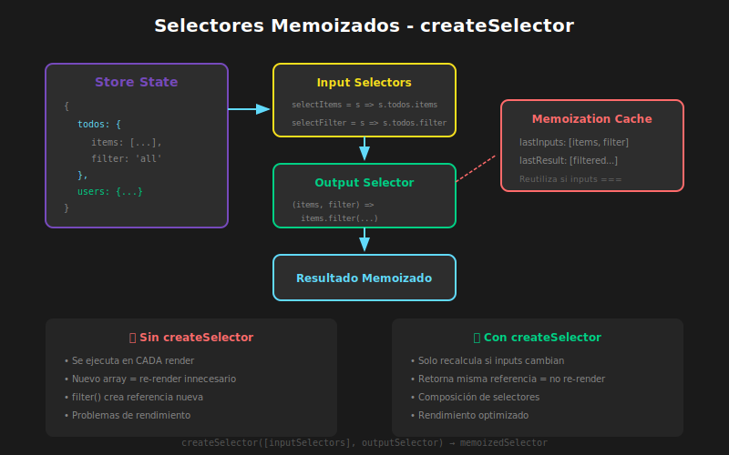

# 📖 Selectores y Normalización

## 🎯 Objetivos de Aprendizaje

- Dominar `createSelector` para selectores memoizados
- Normalizar estado con `createEntityAdapter`
- Optimizar rendimiento evitando renders innecesarios
- Implementar patrones de datos relacionales
- Comprender cuándo y cómo normalizar

---

## Visualización de Conceptos



---

## 1. Selectores: Conceptos Básicos

### 1.1 ¿Qué es un Selector?

```typescript
// QUÉ: Un selector es una función que extrae datos del estado
// PARA: Encapsular la forma del estado y derivar datos
// IMPACTO: Componentes desacoplados de la estructura del store

// Selector básico - extrae una parte del estado
const selectTodos = (state: RootState) => state.todos.items;

// Selector derivado - calcula un valor a partir del estado
const selectCompletedTodos = (state: RootState) =>
  state.todos.items.filter((todo) => todo.completed);

// Selector con parámetros
const selectTodoById = (id: string) => (state: RootState) =>
  state.todos.items.find((todo) => todo.id === id);
```

### 1.2 El Problema de Rendimiento

```typescript
// ❌ PROBLEMA: Este selector se recalcula en CADA render

const selectFilteredTodos = (state: RootState) => {
  console.log('Calculando todos filtrados...'); // Se ejecuta siempre

  const { items, filter, searchQuery } = state.todos;

  return items
    .filter((todo) => {
      if (filter === 'active') return !todo.completed;
      if (filter === 'completed') return todo.completed;
      return true;
    })
    .filter((todo) =>
      todo.text.toLowerCase().includes(searchQuery.toLowerCase()),
    );
};

// Cada vez que CUALQUIER parte del estado cambia,
// useSelector re-ejecuta el selector
// Si el resultado es un nuevo array (referencia diferente),
// el componente se re-renderiza aunque los datos sean iguales
```

---

## 2. createSelector para Memoización

### 2.1 Sintaxis de createSelector

```typescript
import { createSelector } from '@reduxjs/toolkit';

// QUÉ: createSelector crea selectores memoizados
// PARA: Evitar cálculos innecesarios y renders
// IMPACTO: Solo recalcula cuando las dependencias cambian

// createSelector recibe:
// 1. Input selectors (uno o más)
// 2. Output selector (combina los resultados)

const selectFilteredTodos = createSelector(
  // Input selectors - extraen datos del estado
  [
    (state: RootState) => state.todos.items,
    (state: RootState) => state.todos.filter,
    (state: RootState) => state.todos.searchQuery,
  ],

  // Output selector - recibe los resultados de los inputs
  (items, filter, searchQuery) => {
    console.log('Recalculando...'); // Solo cuando items, filter o searchQuery cambian

    return items
      .filter((todo) => {
        if (filter === 'active') return !todo.completed;
        if (filter === 'completed') return todo.completed;
        return true;
      })
      .filter((todo) =>
        todo.text.toLowerCase().includes(searchQuery.toLowerCase()),
      );
  },
);
```

### 2.2 Ejemplo Completo de Selectores

```typescript
// src/features/todos/todosSelectors.ts

import { createSelector } from '@reduxjs/toolkit';
import type { RootState } from '../../app/store';

// ============================================
// SELECTORES BÁSICOS (no memoizados)
// ============================================

// Extraen partes simples del estado
export const selectTodosState = (state: RootState) => state.todos;
export const selectTodoItems = (state: RootState) => state.todos.items;
export const selectFilter = (state: RootState) => state.todos.filter;
export const selectSearchQuery = (state: RootState) => state.todos.searchQuery;

// ============================================
// SELECTORES MEMOIZADOS
// ============================================

// Todos filtrados por estado (all/active/completed)
export const selectFilteredByStatus = createSelector(
  [selectTodoItems, selectFilter],
  (items, filter) => {
    switch (filter) {
      case 'active':
        return items.filter((todo) => !todo.completed);
      case 'completed':
        return items.filter((todo) => todo.completed);
      default:
        return items;
    }
  },
);

// Todos filtrados por búsqueda
export const selectFilteredTodos = createSelector(
  [selectFilteredByStatus, selectSearchQuery],
  (items, searchQuery) => {
    if (!searchQuery.trim()) return items;

    const query = searchQuery.toLowerCase();
    return items.filter((todo) => todo.text.toLowerCase().includes(query));
  },
);

// Estadísticas de todos
export const selectTodoStats = createSelector([selectTodoItems], (items) => ({
  total: items.length,
  completed: items.filter((t) => t.completed).length,
  active: items.filter((t) => !t.completed).length,
  percentComplete:
    items.length > 0
      ? Math.round(
          (items.filter((t) => t.completed).length / items.length) * 100,
        )
      : 0,
}));

// Todos ordenados por fecha
export const selectTodosSortedByDate = createSelector(
  [selectFilteredTodos],
  (items) =>
    [...items].sort(
      (a, b) =>
        new Date(b.createdAt).getTime() - new Date(a.createdAt).getTime(),
    ),
);

// Todos agrupados por estado
export const selectTodosGrouped = createSelector(
  [selectTodoItems],
  (items) => ({
    active: items.filter((t) => !t.completed),
    completed: items.filter((t) => t.completed),
  }),
);
```

### 2.3 Selectores con Parámetros

```typescript
// ============================================
// OPCIÓN 1: Factory de selectores
// ============================================

// Crea un nuevo selector para cada ID
export const makeSelectTodoById = () =>
  createSelector(
    [selectTodoItems, (_: RootState, todoId: string) => todoId],
    (items, todoId) => items.find((todo) => todo.id === todoId),
  );

// Uso en componente:
const TodoItem: React.FC<{ id: string }> = ({ id }) => {
  // Memoizar el selector para este componente
  const selectTodoById = useMemo(makeSelectTodoById, []);
  const todo = useAppSelector((state) => selectTodoById(state, id));
  // ...
};

// ============================================
// OPCIÓN 2: Selector simple con closure
// ============================================

export const selectTodoById = (id: string) => (state: RootState) =>
  state.todos.items.find((todo) => todo.id === id);

// Uso:
const todo = useAppSelector(selectTodoById('todo-123'));

// ============================================
// OPCIÓN 3: Selector parametrizado memoizado
// ============================================

export const selectTodosByCategory = createSelector(
  [selectTodoItems, (_: RootState, category: string) => category],
  (items, category) => items.filter((todo) => todo.category === category),
);

// Uso:
const workTodos = useAppSelector((state) =>
  selectTodosByCategory(state, 'work'),
);
```

---

## 3. Cuándo Usar createSelector

### 3.1 Decisiones de Memoización

```typescript
// ✅ USAR createSelector cuando:

// 1. El selector hace transformaciones costosas
const selectSortedUsers = createSelector([selectUsers], (users) =>
  [...users].sort((a, b) => a.name.localeCompare(b.name)),
);

// 2. El selector filtra o mapea arrays
const selectActiveUsers = createSelector([selectUsers], (users) =>
  users.filter((u) => u.isActive),
);

// 3. El selector combina datos de múltiples slices
const selectUserWithPosts = createSelector(
  [selectSelectedUser, selectPostsByUserId],
  (user, posts) => ({ ...user, posts }),
);

// 4. El selector retorna un nuevo objeto/array
const selectUserNames = createSelector([selectUsers], (users) =>
  users.map((u) => u.name),
);

// ❌ NO necesitas createSelector cuando:

// 1. Solo extraes una parte del estado
const selectUserId = (state: RootState) => state.auth.user?.id;

// 2. El resultado es un primitivo
const selectIsLoggedIn = (state: RootState) => state.auth.isAuthenticated;

// 3. Retornas la misma referencia del estado
const selectTodos = (state: RootState) => state.todos.items;
```

---

## 4. createEntityAdapter para Normalización

### 4.1 El Problema: Estado Desnormalizado

```typescript
// ❌ ESTADO DESNORMALIZADO - Datos duplicados y difícil de actualizar

interface PostsState {
  posts: Array<{
    id: string;
    title: string;
    content: string;
    author: {
      id: string;
      name: string;
      avatar: string;
    };
    comments: Array<{
      id: string;
      text: string;
      author: {
        id: string;
        name: string; // ¡Duplicado!
        avatar: string; // ¡Duplicado!
      };
    }>;
  }>;
}

// Problemas:
// 1. Si el usuario cambia su nombre, hay que actualizar TODAS las copias
// 2. Buscar un post específico requiere recorrer todo el array O(n)
// 3. Actualizar un item requiere find + spread (verboso)
```

### 4.2 La Solución: Estado Normalizado

```typescript
// ✅ ESTADO NORMALIZADO - Una sola fuente de verdad

interface NormalizedState {
  users: {
    ids: string[];
    entities: Record<string, User>;
  };
  posts: {
    ids: string[];
    entities: Record<string, Post>;
  };
  comments: {
    ids: string[];
    entities: Record<string, Comment>;
  };
}

// Post solo tiene IDs de relaciones
interface Post {
  id: string;
  title: string;
  content: string;
  authorId: string; // Solo el ID
  commentIds: string[]; // Solo IDs
}

// Ventajas:
// 1. Actualizar usuario se hace en UN lugar
// 2. Acceso O(1) por ID: entities[id]
// 3. Fácil de actualizar: entities[id] = { ...entities[id], ...changes }
```

### 4.3 createEntityAdapter

```typescript
import {
  createSlice,
  createEntityAdapter,
  PayloadAction,
} from '@reduxjs/toolkit';
import type { RootState } from '../../app/store';

// ============================================
// TIPO DE ENTIDAD
// ============================================

interface Product {
  id: string;
  name: string;
  price: number;
  category: string;
  stock: number;
  createdAt: string;
}

// ============================================
// CREAR ADAPTER
// ============================================

// QUÉ: createEntityAdapter genera CRUD helpers
// PARA: Gestionar colecciones normalizadas
// IMPACTO: Reduce boilerplate para operaciones comunes

const productsAdapter = createEntityAdapter<Product>({
  // Función para obtener el ID (por defecto busca 'id')
  selectId: (product) => product.id,

  // Función para ordenar las entidades
  sortComparer: (a, b) => a.name.localeCompare(b.name),
});

// ============================================
// ESTADO INICIAL
// ============================================

// Estructura generada por el adapter:
// {
//   ids: string[];           // Array de IDs en orden
//   entities: Record<string, Product>; // Diccionario id -> entidad
// }

interface ProductsState {
  status: 'idle' | 'loading' | 'succeeded' | 'failed';
  error: string | null;
  selectedId: string | null;
}

// Combinar estado del adapter con estado adicional
const initialState = productsAdapter.getInitialState<ProductsState>({
  status: 'idle',
  error: null,
  selectedId: null,
});

// ============================================
// SLICE
// ============================================

const productsSlice = createSlice({
  name: 'products',
  initialState,
  reducers: {
    // Usar métodos del adapter directamente
    productAdded: productsAdapter.addOne,
    productsReceived: productsAdapter.setAll,
    productUpdated: productsAdapter.updateOne,
    productRemoved: productsAdapter.removeOne,

    // Acciones personalizadas
    setSelectedProduct: (state, action: PayloadAction<string | null>) => {
      state.selectedId = action.payload;
    },

    // Combinando adapter con lógica custom
    updateStock: (
      state,
      action: PayloadAction<{ id: string; quantity: number }>,
    ) => {
      const { id, quantity } = action.payload;
      const product = state.entities[id];
      if (product) {
        product.stock += quantity;
      }
    },
  },
  extraReducers: (builder) => {
    // En async thunks
    builder
      .addCase(fetchProducts.pending, (state) => {
        state.status = 'loading';
      })
      .addCase(fetchProducts.fulfilled, (state, action) => {
        state.status = 'succeeded';
        // setAll reemplaza todas las entidades
        productsAdapter.setAll(state, action.payload);
      })
      .addCase(fetchProducts.rejected, (state, action) => {
        state.status = 'failed';
        state.error = action.error.message ?? 'Error';
      });
  },
});

// ============================================
// SELECTORES
// ============================================

// El adapter genera selectores automáticamente
const productsSelectors = productsAdapter.getSelectors<RootState>(
  (state) => state.products,
);

// Selectores generados:
export const {
  selectAll: selectAllProducts, // Retorna array de todos los productos
  selectById: selectProductById, // Retorna producto por ID
  selectIds: selectProductIds, // Retorna array de IDs
  selectEntities: selectProductEntities, // Retorna diccionario
  selectTotal: selectProductTotal, // Retorna cantidad total
} = productsSelectors;

// Selectores custom adicionales
export const selectSelectedProduct = createSelector(
  [selectProductEntities, (state: RootState) => state.products.selectedId],
  (entities, selectedId) => (selectedId ? entities[selectedId] : null),
);

export const selectProductsByCategory = createSelector(
  [selectAllProducts, (_: RootState, category: string) => category],
  (products, category) => products.filter((p) => p.category === category),
);

export const selectLowStockProducts = createSelector(
  [selectAllProducts],
  (products) => products.filter((p) => p.stock < 10),
);

// Actions
export const {
  productAdded,
  productsReceived,
  productUpdated,
  productRemoved,
  setSelectedProduct,
  updateStock,
} = productsSlice.actions;

export default productsSlice.reducer;
```

### 4.4 Métodos del Entity Adapter

```typescript
// ============================================
// MÉTODOS CRUD DEL ADAPTER
// ============================================

const adapter = createEntityAdapter<Entity>();

// ── AGREGAR ──
adapter.addOne(state, entity); // Agregar uno
adapter.addMany(state, entities); // Agregar varios

// ── ESTABLECER (reemplazar) ──
adapter.setOne(state, entity); // Agregar/reemplazar uno
adapter.setMany(state, entities); // Agregar/reemplazar varios
adapter.setAll(state, entities); // Reemplazar TODOS

// ── ACTUALIZAR ──
adapter.updateOne(state, { id, changes: Partial<Entity> });
adapter.updateMany(state, updates); // Array de { id, changes }

// ── UPSERT (insert or update) ──
adapter.upsertOne(state, entity); // Insertar o actualizar uno
adapter.upsertMany(state, entities); // Insertar o actualizar varios

// ── ELIMINAR ──
adapter.removeOne(state, id); // Eliminar por ID
adapter.removeMany(state, ids); // Eliminar varios por IDs
adapter.removeAll(state); // Eliminar todos

// ── OBTENER ESTADO INICIAL ──
adapter.getInitialState(); // { ids: [], entities: {} }
adapter.getInitialState({ extra: 'data' }); // Con propiedades adicionales

// ============================================
// EJEMPLO DE USO EN REDUCERS
// ============================================

const slice = createSlice({
  name: 'items',
  initialState: adapter.getInitialState(),
  reducers: {
    // Forma directa - el método ES el reducer
    itemAdded: adapter.addOne,
    itemsReceived: adapter.setAll,
    itemRemoved: adapter.removeOne,

    // Forma con lógica adicional
    itemUpdated: (
      state,
      action: PayloadAction<{ id: string; changes: Partial<Item> }>,
    ) => {
      // Lógica previa
      if (!state.entities[action.payload.id]) return;

      // Usar adapter
      adapter.updateOne(state, action.payload);

      // Lógica posterior
      console.log('Item actualizado');
    },
  },
});
```

---

## 5. Relaciones entre Entidades

### 5.1 Ejemplo: Posts con Autores y Comentarios

```typescript
// ============================================
// TIPOS NORMALIZADOS
// ============================================

interface User {
  id: string;
  name: string;
  email: string;
  avatar: string;
}

interface Post {
  id: string;
  title: string;
  content: string;
  authorId: string; // Referencia a User
  createdAt: string;
}

interface Comment {
  id: string;
  text: string;
  postId: string; // Referencia a Post
  authorId: string; // Referencia a User
  createdAt: string;
}

// ============================================
// ADAPTERS
// ============================================

const usersAdapter = createEntityAdapter<User>();
const postsAdapter = createEntityAdapter<Post>({
  sortComparer: (a, b) =>
    new Date(b.createdAt).getTime() - new Date(a.createdAt).getTime(),
});
const commentsAdapter = createEntityAdapter<Comment>();

// ============================================
// SELECTOR: Post con datos denormalizados
// ============================================

import { createSelector } from '@reduxjs/toolkit';

// Selectores base
const selectUsers = (state: RootState) => state.users.entities;
const selectPosts = (state: RootState) => state.posts.entities;
const selectComments = (state: RootState) => state.comments;

// Selector que "denormaliza" para UI
export const selectPostWithDetails = createSelector(
  [
    selectPosts,
    selectUsers,
    selectComments,
    (_: RootState, postId: string) => postId,
  ],
  (posts, users, commentsState, postId) => {
    const post = posts[postId];
    if (!post) return null;

    // Obtener autor
    const author = users[post.authorId];

    // Obtener comentarios del post
    const postComments = commentsState.ids
      .map((id) => commentsState.entities[id]!)
      .filter((comment) => comment.postId === postId)
      .map((comment) => ({
        ...comment,
        author: users[comment.authorId],
      }));

    return {
      ...post,
      author,
      comments: postComments,
    };
  },
);

// Tipo del resultado denormalizado
interface PostWithDetails {
  id: string;
  title: string;
  content: string;
  createdAt: string;
  author: User;
  comments: Array<Comment & { author: User }>;
}
```

### 5.2 Selector para Lista con Relaciones

```typescript
// Todos los posts con su autor (para lista)
export const selectAllPostsWithAuthor = createSelector(
  [
    postsAdapter.getSelectors<RootState>((s) => s.posts).selectAll,
    (state: RootState) => state.users.entities,
  ],
  (posts, users) =>
    posts.map((post) => ({
      ...post,
      author: users[post.authorId],
    })),
);

// Posts de un usuario específico
export const selectPostsByUser = createSelector(
  [
    postsAdapter.getSelectors<RootState>((s) => s.posts).selectAll,
    (_: RootState, userId: string) => userId,
  ],
  (posts, userId) => posts.filter((post) => post.authorId === userId),
);
```

---

## 6. Uso en Componentes

### 6.1 Lista de Productos

```typescript
// src/features/products/ProductList.tsx

import { useAppSelector, useAppDispatch } from '../../app/hooks';
import {
  selectAllProducts,
  selectProductsByCategory,
  selectLowStockProducts,
  productRemoved,
  setSelectedProduct,
} from './productsSlice';

export const ProductList: React.FC<{ category?: string }> = ({ category }) => {
  const dispatch = useAppDispatch();

  // Selector condicional según props
  const products = useAppSelector(state =>
    category
      ? selectProductsByCategory(state, category)
      : selectAllProducts(state)
  );

  const lowStockProducts = useAppSelector(selectLowStockProducts);

  const handleDelete = (id: string) => {
    if (confirm('¿Eliminar producto?')) {
      dispatch(productRemoved(id));
    }
  };

  const handleSelect = (id: string) => {
    dispatch(setSelectedProduct(id));
  };

  return (
    <div>
      {lowStockProducts.length > 0 && (
        <div className="warning">
          ⚠️ {lowStockProducts.length} productos con stock bajo
        </div>
      )}

      <ul className="product-list">
        {products.map(product => (
          <li key={product.id} onClick={() => handleSelect(product.id)}>
            <h3>{product.name}</h3>
            <p>${product.price}</p>
            <span>Stock: {product.stock}</span>
            <button onClick={() => handleDelete(product.id)}>
              Eliminar
            </button>
          </li>
        ))}
      </ul>
    </div>
  );
};
```

### 6.2 Detalle con Selector Factory

```typescript
// src/features/products/ProductDetail.tsx

import { useMemo } from 'react';
import { createSelector } from '@reduxjs/toolkit';
import { useAppSelector, useAppDispatch } from '../../app/hooks';
import { selectProductEntities, updateStock } from './productsSlice';
import type { RootState } from '../../app/store';

interface ProductDetailProps {
  productId: string;
}

// Factory para crear selector memoizado por ID
const makeSelectProductById = (productId: string) =>
  createSelector(
    [selectProductEntities],
    (entities) => entities[productId]
  );

export const ProductDetail: React.FC<ProductDetailProps> = ({ productId }) => {
  const dispatch = useAppDispatch();

  // Memoizar el selector para este productId específico
  const selectProduct = useMemo(
    () => makeSelectProductById(productId),
    [productId]
  );

  const product = useAppSelector(selectProduct);

  if (!product) {
    return <div>Producto no encontrado</div>;
  }

  const handleStockChange = (delta: number) => {
    dispatch(updateStock({ id: productId, quantity: delta }));
  };

  return (
    <div className="product-detail">
      <h2>{product.name}</h2>
      <p className="price">${product.price.toFixed(2)}</p>
      <p className="category">{product.category}</p>

      <div className="stock-control">
        <button onClick={() => handleStockChange(-1)} disabled={product.stock === 0}>
          -
        </button>
        <span>{product.stock} en stock</span>
        <button onClick={() => handleStockChange(1)}>
          +
        </button>
      </div>
    </div>
  );
};
```

---

## 📝 Resumen

| Concepto                  | Descripción                                 |
| ------------------------- | ------------------------------------------- |
| `createSelector`          | Selectores memoizados que evitan recálculos |
| Input selectors           | Extraen datos del estado                    |
| Output selector           | Combina y transforma los inputs             |
| `createEntityAdapter`     | Gestiona colecciones normalizadas           |
| Normalización             | IDs + entities en lugar de arrays anidados  |
| `selectAll`, `selectById` | Selectores generados por el adapter         |

---

## ✅ Checklist de Verificación

- [ ] Puedo crear selectores memoizados con `createSelector`
- [ ] Entiendo cuándo usar memoización y cuándo no
- [ ] Sé crear selectores con parámetros (factory pattern)
- [ ] Puedo usar `createEntityAdapter` para normalizar estado
- [ ] Entiendo la estructura `ids` + `entities`
- [ ] Puedo crear selectores que denormalizan para la UI

---

[← Anterior: Async Thunks](04-async-thunks.md) | [Volver al README →](../README.md)
