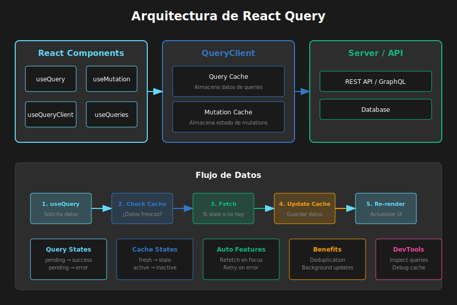

# 📖 Introducción a React Query (TanStack Query)

## 🎯 Objetivos de Aprendizaje

- Comprender la diferencia entre Server State y Client State
- Identificar los problemas que React Query resuelve
- Configurar QueryClient y QueryClientProvider
- Conocer la arquitectura y conceptos fundamentales

---

## Visualización de Conceptos



---

## 1. El Problema del Server State

### 1.1 ¿Qué es Server State?

```typescript
// SERVER STATE - Datos que viven en el servidor
// Características:
// - Se almacena remotamente (base de datos, API)
// - Puede cambiar sin que lo sepamos
// - Requiere API calls para acceder
// - Compartido entre múltiples usuarios
// - Puede estar desactualizado (stale)

interface ServerState {
  users: User[]; // Vienen de /api/users
  products: Product[]; // Vienen de /api/products
  orders: Order[]; // Vienen de /api/orders
}

// CLIENT STATE - Datos que viven en el cliente
// Características:
// - Controlado completamente por la app
// - Sincrónico y predecible
// - No compartido entre usuarios
// - Siempre actualizado

interface ClientState {
  isModalOpen: boolean;
  selectedTheme: 'light' | 'dark';
  sidebarCollapsed: boolean;
}
```

### 1.2 Problemas sin React Query

```typescript
// ❌ PROBLEMA: Manejo manual de server state
const UsersPage: React.FC = () => {
  const [users, setUsers] = useState<User[]>([]);
  const [isLoading, setIsLoading] = useState(false);
  const [error, setError] = useState<Error | null>(null);

  useEffect(() => {
    const fetchUsers = async () => {
      setIsLoading(true);
      setError(null);
      try {
        const response = await fetch('/api/users');
        if (!response.ok) throw new Error('Failed to fetch');
        const data = await response.json();
        setUsers(data);
      } catch (err) {
        setError(err as Error);
      } finally {
        setIsLoading(false);
      }
    };

    fetchUsers();
  }, []);

  // 😰 Problemas:
  // 1. No hay caché - cada visita = nueva request
  // 2. No hay deduplicación - múltiples componentes = múltiples requests
  // 3. No hay revalidación - datos pueden estar stale
  // 4. No hay retry automático
  // 5. Mucho boilerplate

  if (isLoading) return <Spinner />;
  if (error) return <Error message={error.message} />;
  return <UserList users={users} />;
};
```

---

## 2. ¿Qué es React Query?

### 2.1 La Solución Elegante

```typescript
// ✅ SOLUCIÓN: React Query maneja todo automáticamente
import { useQuery } from '@tanstack/react-query';

const UsersPage: React.FC = () => {
  const { data: users, isLoading, error } = useQuery({
    queryKey: ['users'],
    queryFn: () => fetch('/api/users').then(res => res.json()),
  });

  // 🎉 Beneficios automáticos:
  // ✅ Caché inteligente
  // ✅ Deduplicación de requests
  // ✅ Revalidación en segundo plano
  // ✅ Retry automático
  // ✅ Garbage collection
  // ✅ DevTools incluidos

  if (isLoading) return <Spinner />;
  if (error) return <Error message={error.message} />;
  return <UserList users={users} />;
};
```

### 2.2 Características Principales

| Característica             | Descripción                                            |
| -------------------------- | ------------------------------------------------------ |
| **Caching**                | Almacena respuestas para reutilización                 |
| **Deduplication**          | Una sola request aunque múltiples componentes la pidan |
| **Background Updates**     | Revalida datos mientras muestra caché                  |
| **Stale-While-Revalidate** | Muestra datos "viejos" mientras actualiza              |
| **Automatic Retries**      | Reintenta requests fallidas                            |
| **Pagination & Infinite**  | Soporte nativo para listas infinitas                   |
| **Optimistic Updates**     | Actualiza UI antes de confirmar con servidor           |
| **DevTools**               | Herramientas de debugging incluidas                    |

---

## 3. Configuración Inicial

### 3.1 Instalación

```bash
# Instalar React Query
pnpm add @tanstack/react-query

# DevTools (opcional pero muy recomendado)
pnpm add @tanstack/react-query-devtools
```

### 3.2 Configurar QueryClient

```typescript
// src/main.tsx

import React from 'react';
import ReactDOM from 'react-dom/client';
import { QueryClient, QueryClientProvider } from '@tanstack/react-query';
import { ReactQueryDevtools } from '@tanstack/react-query-devtools';
import App from './App';

// Crear el cliente con configuración
const queryClient = new QueryClient({
  defaultOptions: {
    queries: {
      // Tiempo que los datos se consideran "frescos"
      staleTime: 1000 * 60 * 5, // 5 minutos

      // Tiempo que los datos permanecen en caché después de no usarse
      gcTime: 1000 * 60 * 30, // 30 minutos (antes: cacheTime)

      // Reintentos en caso de error
      retry: 3,

      // Refetch cuando la ventana recupera foco
      refetchOnWindowFocus: true,

      // Refetch cuando se reconecta internet
      refetchOnReconnect: true,
    },
    mutations: {
      // Reintentos para mutations
      retry: 1,
    },
  },
});

ReactDOM.createRoot(document.getElementById('root')!).render(
  <React.StrictMode>
    <QueryClientProvider client={queryClient}>
      <App />
      {/* DevTools solo en desarrollo */}
      <ReactQueryDevtools initialIsOpen={false} />
    </QueryClientProvider>
  </React.StrictMode>
);
```

### 3.3 Estructura de Proyecto Recomendada

```
src/
├── api/
│   ├── client.ts         # Configuración de fetch/axios
│   ├── users.ts          # Funciones de API para usuarios
│   └── products.ts       # Funciones de API para productos
├── hooks/
│   ├── useUsers.ts       # Custom hook con useQuery
│   └── useProducts.ts    # Custom hook con useQuery
├── components/
│   └── ...
├── App.tsx
└── main.tsx              # QueryClientProvider aquí
```

---

## 4. Ciclo de Vida de una Query

### 4.1 Estados de una Query

```typescript
// Una query puede estar en varios estados:

const { data, status, fetchStatus } = useQuery({
  queryKey: ['users'],
  queryFn: fetchUsers,
});

// STATUS (estado de los datos)
// - 'pending': No hay datos todavía (primera carga)
// - 'error': La query falló
// - 'success': Datos disponibles

// FETCH STATUS (estado de la red)
// - 'fetching': Haciendo request ahora
// - 'paused': La query está pausada (ej: sin conexión)
// - 'idle': No está haciendo fetch

// Combinaciones comunes:
// status='pending' + fetchStatus='fetching' → Primera carga
// status='success' + fetchStatus='idle' → Datos frescos
// status='success' + fetchStatus='fetching' → Revalidando en background
// status='error' + fetchStatus='idle' → Error, no reintentando
```

### 4.2 Flujo de Datos

```
1. Componente monta
   │
   ▼
2. ¿Hay datos en caché?
   │
   ├─ SÍ ──► ¿Están stale?
   │         │
   │         ├─ NO ──► Usar caché (no fetch)
   │         │
   │         └─ SÍ ──► Mostrar caché + fetch en background
   │
   └─ NO ──► Mostrar loading + fetch
   │
   ▼
3. Fetch completo
   │
   ├─ ÉXITO ──► Actualizar caché y UI
   │
   └─ ERROR ──► ¿Reintentar?
               │
               ├─ SÍ ──► Esperar y reintentar
               │
               └─ NO ──► Mostrar error
```

---

## 5. Query Keys: Identificación de Datos

### 5.1 Importancia de Query Keys

```typescript
// Las query keys identifican ÚNICAMENTE cada conjunto de datos
// React Query usa estas keys para:
// - Cachear datos
// - Deduplicar requests
// - Invalidar datos
// - Refetch

// ✅ BIEN - Keys como arrays
useQuery({ queryKey: ['users'], queryFn: fetchUsers });
useQuery({ queryKey: ['users', userId], queryFn: () => fetchUser(userId) });
useQuery({
  queryKey: ['users', { status: 'active' }],
  queryFn: fetchActiveUsers,
});

// ❌ MAL - Keys como strings
useQuery({ queryKey: 'users', queryFn: fetchUsers }); // No usar strings
```

### 5.2 Estructura de Query Keys

```typescript
// Patrón recomendado: de general a específico

// Entidad base
['users'][
  // Entidad con ID
  ('users', userId)
][
  // Entidad con filtros
  ('users', { status: 'active', role: 'admin' })
][
  // Entidad con ID y sub-recurso
  ('users', userId, 'posts')
];

// Ejemplo práctico:
const useUser = (userId: string) => {
  return useQuery({
    queryKey: ['users', userId],
    queryFn: () => fetchUser(userId),
  });
};

const useUserPosts = (userId: string) => {
  return useQuery({
    queryKey: ['users', userId, 'posts'],
    queryFn: () => fetchUserPosts(userId),
  });
};

// Invalidar todo lo relacionado con usuarios:
queryClient.invalidateQueries({ queryKey: ['users'] });

// Invalidar solo un usuario específico:
queryClient.invalidateQueries({ queryKey: ['users', userId] });
```

---

## 6. Comparación con Otras Soluciones

### 6.1 React Query vs Redux

| Aspecto                 | Redux (RTK)         | React Query  |
| ----------------------- | ------------------- | ------------ |
| **Propósito principal** | Client state global | Server state |
| **Caché automático**    | No (manual)         | Sí           |
| **Deduplicación**       | Manual              | Automática   |
| **Revalidación**        | Manual              | Automática   |
| **DevTools**            | Sí                  | Sí           |
| **Boilerplate**         | Medio (con RTK)     | Bajo         |
| **Curva aprendizaje**   | Media               | Baja         |

### 6.2 ¿Cuándo usar cada uno?

```typescript
// ✅ React Query para:
// - Datos del servidor (usuarios, productos, posts)
// - Datos que cambian frecuentemente
// - Datos compartidos entre usuarios

// ✅ Redux/Zustand para:
// - Estado de UI (modales, sidebars)
// - Preferencias del usuario (tema, idioma)
// - Datos complejos con muchas relaciones

// ✅ Ambos juntos:
// - React Query: fetch de productos
// - Redux: carrito de compras (client state)
```

---

## 7. Ejemplo Completo

```typescript
// src/api/users.ts
export interface User {
  id: number;
  name: string;
  email: string;
}

const API_URL = 'https://jsonplaceholder.typicode.com';

export const fetchUsers = async (): Promise<User[]> => {
  const response = await fetch(`${API_URL}/users`);
  if (!response.ok) {
    throw new Error('Error al cargar usuarios');
  }
  return response.json();
};

export const fetchUser = async (id: number): Promise<User> => {
  const response = await fetch(`${API_URL}/users/${id}`);
  if (!response.ok) {
    throw new Error('Usuario no encontrado');
  }
  return response.json();
};
```

```typescript
// src/hooks/useUsers.ts
import { useQuery } from '@tanstack/react-query';
import { fetchUsers, fetchUser, User } from '../api/users';

export const useUsers = () => {
  return useQuery<User[], Error>({
    queryKey: ['users'],
    queryFn: fetchUsers,
  });
};

export const useUser = (id: number) => {
  return useQuery<User, Error>({
    queryKey: ['users', id],
    queryFn: () => fetchUser(id),
    enabled: id > 0, // Solo ejecutar si hay ID válido
  });
};
```

```tsx
// src/components/UserList.tsx
import { useUsers } from '../hooks/useUsers';

const UserList: React.FC = () => {
  const { data: users, isLoading, isError, error, refetch } = useUsers();

  if (isLoading) {
    return <div className="loading">Cargando usuarios...</div>;
  }

  if (isError) {
    return (
      <div className="error">
        <p>Error: {error.message}</p>
        <button onClick={() => refetch()}>Reintentar</button>
      </div>
    );
  }

  return (
    <ul className="user-list">
      {users?.map((user) => (
        <li key={user.id}>
          <strong>{user.name}</strong>
          <span>{user.email}</span>
        </li>
      ))}
    </ul>
  );
};

export default UserList;
```

---

## ✅ Checklist de Verificación

- [ ] Entiendo la diferencia entre Server State y Client State
- [ ] Puedo explicar los problemas que React Query resuelve
- [ ] Sé configurar QueryClient con opciones básicas
- [ ] Comprendo la estructura de Query Keys
- [ ] Conozco los estados de una query (pending, error, success)
- [ ] Sé cuándo usar React Query vs Redux

---

## 📚 Recursos Adicionales

- [TanStack Query Docs](https://tanstack.com/query/latest)
- [Query Keys](https://tanstack.com/query/latest/docs/framework/react/guides/query-keys)
- [Why React Query?](https://tanstack.com/query/latest/docs/framework/react/overview)

---

_Siguiente: [02 - Queries con useQuery](02-queries-useQuery.md)_
