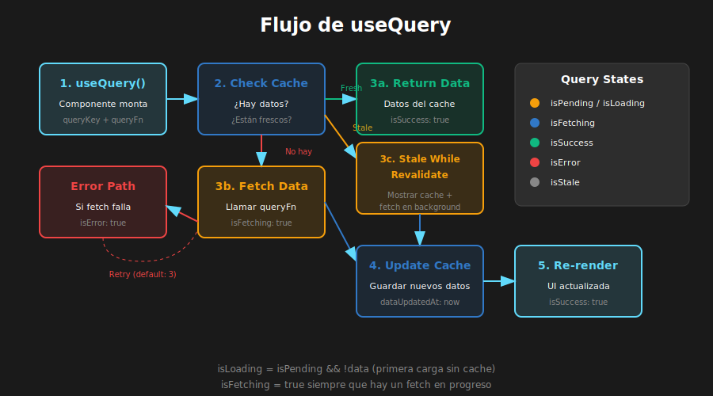

# 📖 Queries con useQuery

## 🎯 Objetivos de Aprendizaje

- Dominar el hook `useQuery` para fetching de datos
- Manejar estados de loading, error y success
- Configurar opciones: staleTime, gcTime, enabled, select
- Crear custom hooks tipados con TypeScript
- Implementar queries dependientes y condicionales

---

## Visualización del Flujo



---

## 1. Anatomía de useQuery

### 1.1 Estructura Básica

```typescript
import { useQuery } from '@tanstack/react-query';

// QUÉ: useQuery es el hook principal para fetching de datos
// PARA: Obtener datos del servidor con caché automático
// IMPACTO: Simplifica manejo de loading, error, y datos

const {
  data, // Los datos retornados por queryFn
  error, // Error si la query falló
  isLoading, // true en primera carga (sin datos en caché)
  isFetching, // true cuando está haciendo fetch (incluye refetch)
  isError, // true si hay error
  isSuccess, // true si tiene datos
  status, // 'pending' | 'error' | 'success'
  fetchStatus, // 'fetching' | 'paused' | 'idle'
  refetch, // Función para refetch manual
} = useQuery({
  queryKey: ['users'], // Identificador único (requerido)
  queryFn: () => fetchUsers(), // Función que retorna Promise (requerido)
});
```

### 1.2 Query Function

```typescript
// La queryFn debe retornar una Promise
// Puede ser cualquier función async

// ✅ BIEN - Fetch API
const queryFn = async () => {
  const response = await fetch('/api/users');
  if (!response.ok) {
    throw new Error('Network response was not ok');
  }
  return response.json();
};

// ✅ BIEN - Axios
const queryFn = async () => {
  const { data } = await axios.get('/api/users');
  return data;
};

// ✅ BIEN - Función con parámetros (usando closure)
const fetchUser = async (userId: string) => {
  const response = await fetch(`/api/users/${userId}`);
  return response.json();
};

useQuery({
  queryKey: ['users', userId],
  queryFn: () => fetchUser(userId),
});

// ✅ BIEN - Usando context de queryKey
useQuery({
  queryKey: ['users', userId],
  queryFn: ({ queryKey }) => {
    const [, id] = queryKey;
    return fetchUser(id as string);
  },
});
```

---

## 2. Estados de la Query

### 2.1 Loading vs Fetching

```typescript
const UserList: React.FC = () => {
  const { data, isLoading, isFetching, isError, error } = useQuery({
    queryKey: ['users'],
    queryFn: fetchUsers,
  });

  // isLoading: true SOLO en primera carga (no hay datos en caché)
  // isFetching: true SIEMPRE que está haciendo fetch (incluye refetch)

  // Primera carga:
  // isLoading = true, isFetching = true, data = undefined

  // Refetch con datos en caché:
  // isLoading = false, isFetching = true, data = [...]

  if (isLoading) {
    return <FullPageSpinner />;  // Solo primera vez
  }

  if (isError) {
    return <ErrorMessage error={error} />;
  }

  return (
    <div>
      {/* Indicador sutil de refetch */}
      {isFetching && <SmallSpinner />}

      <ul>
        {data?.map(user => (
          <li key={user.id}>{user.name}</li>
        ))}
      </ul>
    </div>
  );
};
```

### 2.2 Manejo de Errores

```typescript
interface ApiError {
  message: string;
  statusCode: number;
}

const useUsers = () => {
  return useQuery<User[], ApiError>({
    queryKey: ['users'],
    queryFn: async () => {
      const response = await fetch('/api/users');

      if (!response.ok) {
        // Lanzar error tipado
        const error: ApiError = {
          message: 'Error al cargar usuarios',
          statusCode: response.status,
        };
        throw error;
      }

      return response.json();
    },
    // Configurar reintentos
    retry: (failureCount, error) => {
      // No reintentar errores 4xx
      if (error.statusCode >= 400 && error.statusCode < 500) {
        return false;
      }
      // Reintentar hasta 3 veces para otros errores
      return failureCount < 3;
    },
  });
};

// Uso con error tipado
const { data, error, isError } = useUsers();

if (isError) {
  console.log(error.statusCode); // TypeScript conoce el tipo
}
```

---

## 3. Opciones de Configuración

### 3.1 Opciones de Tiempo

```typescript
useQuery({
  queryKey: ['users'],
  queryFn: fetchUsers,

  // staleTime: Tiempo que los datos se consideran "frescos"
  // Durante este tiempo, no se hace refetch automático
  staleTime: 1000 * 60 * 5, // 5 minutos
  // staleTime: Infinity, // Nunca stale (datos estáticos)
  // staleTime: 0, // Siempre stale (default)

  // gcTime: Tiempo que los datos permanecen en caché después de no usarse
  // (antes llamado cacheTime)
  gcTime: 1000 * 60 * 30, // 30 minutos

  // refetchInterval: Polling automático
  refetchInterval: 1000 * 30, // Cada 30 segundos
  // refetchInterval: false, // Desactivar (default)

  // refetchIntervalInBackground: Polling incluso cuando tab no está activo
  refetchIntervalInBackground: true,
});
```

### 3.2 Opciones de Comportamiento

```typescript
useQuery({
  queryKey: ['users'],
  queryFn: fetchUsers,

  // enabled: Controla si la query se ejecuta
  // Útil para queries dependientes
  enabled: !!userId, // Solo si hay userId

  // refetchOnWindowFocus: Refetch cuando la ventana recupera foco
  refetchOnWindowFocus: true, // default

  // refetchOnMount: Refetch cuando el componente monta
  refetchOnMount: true, // default
  // refetchOnMount: 'always', // Siempre, incluso si datos frescos

  // refetchOnReconnect: Refetch cuando se reconecta internet
  refetchOnReconnect: true, // default

  // retry: Número de reintentos en caso de error
  retry: 3, // default
  // retry: false, // No reintentar

  // retryDelay: Delay entre reintentos
  retryDelay: (attemptIndex) => Math.min(1000 * 2 ** attemptIndex, 30000),
});
```

### 3.3 Transformación de Datos

```typescript
interface UserDTO {
  id: number;
  first_name: string;
  last_name: string;
  email_address: string;
}

interface User {
  id: number;
  name: string;
  email: string;
}

useQuery<UserDTO[], Error, User[]>({
  queryKey: ['users'],
  queryFn: fetchUsersDTO,

  // select: Transforma los datos antes de retornarlos
  // Solo se ejecuta cuando los datos cambian
  select: (data) =>
    data.map((dto) => ({
      id: dto.id,
      name: `${dto.first_name} ${dto.last_name}`,
      email: dto.email_address,
    })),
});

// Filtrar datos con select
useQuery({
  queryKey: ['users'],
  queryFn: fetchUsers,
  select: (users) => users.filter((u) => u.active),
});
```

---

## 4. Queries Dependientes

### 4.1 Query que Depende de Otra

```typescript
// Primera query: obtener usuario actual
const { data: user } = useQuery({
  queryKey: ['currentUser'],
  queryFn: fetchCurrentUser,
});

// Segunda query: obtener posts del usuario (solo si hay usuario)
const { data: posts } = useQuery({
  queryKey: ['posts', user?.id],
  queryFn: () => fetchUserPosts(user!.id),
  // Solo ejecutar si tenemos el usuario
  enabled: !!user?.id,
});
```

### 4.2 Múltiples Queries Paralelas

```typescript
// Ejecutar múltiples queries en paralelo
const UserDashboard: React.FC<{ userId: string }> = ({ userId }) => {
  // Estas queries se ejecutan en paralelo
  const userQuery = useQuery({
    queryKey: ['users', userId],
    queryFn: () => fetchUser(userId),
  });

  const postsQuery = useQuery({
    queryKey: ['users', userId, 'posts'],
    queryFn: () => fetchUserPosts(userId),
  });

  const followersQuery = useQuery({
    queryKey: ['users', userId, 'followers'],
    queryFn: () => fetchUserFollowers(userId),
  });

  const isLoading = userQuery.isLoading || postsQuery.isLoading || followersQuery.isLoading;

  if (isLoading) return <Spinner />;

  return (
    <div>
      <UserProfile user={userQuery.data} />
      <PostList posts={postsQuery.data} />
      <FollowerList followers={followersQuery.data} />
    </div>
  );
};
```

### 4.3 useQueries para Queries Dinámicas

```typescript
import { useQueries } from '@tanstack/react-query';

// Cuando tienes una lista de IDs y necesitas hacer una query por cada uno
const UserList: React.FC<{ userIds: number[] }> = ({ userIds }) => {
  const userQueries = useQueries({
    queries: userIds.map((id) => ({
      queryKey: ['users', id],
      queryFn: () => fetchUser(id),
    })),
  });

  const isLoading = userQueries.some(q => q.isLoading);
  const users = userQueries.map(q => q.data).filter(Boolean);

  if (isLoading) return <Spinner />;

  return (
    <ul>
      {users.map(user => (
        <li key={user.id}>{user.name}</li>
      ))}
    </ul>
  );
};
```

---

## 5. Custom Hooks Tipados

### 5.1 Patrón Recomendado

```typescript
// src/api/users.ts
const API_URL = '/api';

export interface User {
  id: number;
  name: string;
  email: string;
  role: 'admin' | 'user';
}

export interface UsersFilters {
  role?: string;
  search?: string;
}

export const usersApi = {
  getAll: async (filters?: UsersFilters): Promise<User[]> => {
    const params = new URLSearchParams();
    if (filters?.role) params.append('role', filters.role);
    if (filters?.search) params.append('search', filters.search);

    const response = await fetch(`${API_URL}/users?${params}`);
    if (!response.ok) throw new Error('Failed to fetch users');
    return response.json();
  },

  getById: async (id: number): Promise<User> => {
    const response = await fetch(`${API_URL}/users/${id}`);
    if (!response.ok) throw new Error('User not found');
    return response.json();
  },
};
```

```typescript
// src/hooks/useUsers.ts
import { useQuery, UseQueryOptions } from '@tanstack/react-query';
import { usersApi, User, UsersFilters } from '../api/users';

// Query Keys centralizadas
export const userKeys = {
  all: ['users'] as const,
  lists: () => [...userKeys.all, 'list'] as const,
  list: (filters: UsersFilters) => [...userKeys.lists(), filters] as const,
  details: () => [...userKeys.all, 'detail'] as const,
  detail: (id: number) => [...userKeys.details(), id] as const,
};

// Hook para lista de usuarios
export const useUsers = (
  filters?: UsersFilters,
  options?: Omit<UseQueryOptions<User[], Error>, 'queryKey' | 'queryFn'>,
) => {
  return useQuery({
    queryKey: userKeys.list(filters ?? {}),
    queryFn: () => usersApi.getAll(filters),
    ...options,
  });
};

// Hook para usuario individual
export const useUser = (
  id: number,
  options?: Omit<UseQueryOptions<User, Error>, 'queryKey' | 'queryFn'>,
) => {
  return useQuery({
    queryKey: userKeys.detail(id),
    queryFn: () => usersApi.getById(id),
    enabled: id > 0,
    ...options,
  });
};
```

```tsx
// src/components/UserList.tsx
import { useUsers } from '../hooks/useUsers';

const UserList: React.FC = () => {
  const [roleFilter, setRoleFilter] = useState<string>('');

  const {
    data: users,
    isLoading,
    isError,
  } = useUsers(
    { role: roleFilter || undefined },
    { staleTime: 1000 * 60 * 5 }, // 5 minutos
  );

  // ... render
};
```

---

## 6. Placeholder y Initial Data

### 6.1 Placeholder Data

```typescript
// placeholderData: Datos temporales mientras carga
// NO se guardan en caché
useQuery({
  queryKey: ['users', userId],
  queryFn: () => fetchUser(userId),
  placeholderData: {
    id: 0,
    name: 'Cargando...',
    email: '...',
  },
});

// Usar datos de otra query como placeholder
const { data: users } = useUsers();

const { data: user } = useQuery({
  queryKey: ['users', userId],
  queryFn: () => fetchUser(userId),
  placeholderData: () => {
    // Buscar en la lista de usuarios como placeholder
    return users?.find((u) => u.id === userId);
  },
});
```

### 6.2 Initial Data

```typescript
// initialData: Datos iniciales que SÍ se guardan en caché
// Útil para hydration desde SSR o localStorage
useQuery({
  queryKey: ['users'],
  queryFn: fetchUsers,
  initialData: () => {
    // Obtener de localStorage
    const cached = localStorage.getItem('users');
    return cached ? JSON.parse(cached) : undefined;
  },
  initialDataUpdatedAt: () => {
    // Timestamp de cuando se guardaron
    const timestamp = localStorage.getItem('users_timestamp');
    return timestamp ? parseInt(timestamp) : undefined;
  },
});
```

---

## 7. Ejemplo Completo: Lista de Productos

```typescript
// src/api/products.ts
export interface Product {
  id: number;
  name: string;
  price: number;
  category: string;
  inStock: boolean;
}

export interface ProductsParams {
  category?: string;
  minPrice?: number;
  maxPrice?: number;
  page?: number;
  limit?: number;
}

export const productsApi = {
  getAll: async (params?: ProductsParams): Promise<Product[]> => {
    const searchParams = new URLSearchParams();
    Object.entries(params || {}).forEach(([key, value]) => {
      if (value !== undefined) {
        searchParams.append(key, String(value));
      }
    });

    const response = await fetch(`/api/products?${searchParams}`);
    if (!response.ok) throw new Error('Failed to fetch products');
    return response.json();
  },
};
```

```typescript
// src/hooks/useProducts.ts
import { useQuery } from '@tanstack/react-query';
import { productsApi, Product, ProductsParams } from '../api/products';

export const productKeys = {
  all: ['products'] as const,
  lists: () => [...productKeys.all, 'list'] as const,
  list: (params: ProductsParams) => [...productKeys.lists(), params] as const,
};

export const useProducts = (params?: ProductsParams) => {
  return useQuery<Product[], Error>({
    queryKey: productKeys.list(params ?? {}),
    queryFn: () => productsApi.getAll(params),
    staleTime: 1000 * 60 * 2, // 2 minutos
  });
};
```

```tsx
// src/components/ProductList.tsx
import { useState } from 'react';
import { useProducts } from '../hooks/useProducts';

const ProductList: React.FC = () => {
  const [category, setCategory] = useState<string>('');
  const [priceRange, setPriceRange] = useState({ min: 0, max: 1000 });

  const {
    data: products,
    isLoading,
    isError,
    error,
    isFetching,
    refetch,
  } = useProducts({
    category: category || undefined,
    minPrice: priceRange.min,
    maxPrice: priceRange.max,
  });

  return (
    <div className="products-page">
      {/* Filtros */}
      <aside className="filters">
        <select
          value={category}
          onChange={(e) => setCategory(e.target.value)}>
          <option value="">Todas las categorías</option>
          <option value="electronics">Electrónica</option>
          <option value="clothing">Ropa</option>
          <option value="books">Libros</option>
        </select>

        <button onClick={() => refetch()}>Actualizar</button>
      </aside>

      {/* Contenido */}
      <main className="product-grid">
        {isLoading && <FullPageSpinner />}

        {isError && (
          <ErrorBanner
            message={error.message}
            onRetry={() => refetch()}
          />
        )}

        {/* Indicador de refetch */}
        {isFetching && !isLoading && (
          <div className="refetch-indicator">Actualizando...</div>
        )}

        {products?.map((product) => (
          <ProductCard
            key={product.id}
            product={product}
          />
        ))}

        {products?.length === 0 && (
          <EmptyState message="No se encontraron productos" />
        )}
      </main>
    </div>
  );
};
```

---

## ✅ Checklist de Verificación

- [ ] Sé usar useQuery con queryKey y queryFn
- [ ] Entiendo la diferencia entre isLoading e isFetching
- [ ] Puedo configurar staleTime y gcTime
- [ ] Sé usar enabled para queries condicionales
- [ ] Puedo crear custom hooks tipados
- [ ] Entiendo cómo usar select para transformar datos
- [ ] Sé implementar queries dependientes

---

## 📚 Recursos Adicionales

- [useQuery Reference](https://tanstack.com/query/latest/docs/framework/react/reference/useQuery)
- [Query Options](https://tanstack.com/query/latest/docs/framework/react/guides/important-defaults)
- [Dependent Queries](https://tanstack.com/query/latest/docs/framework/react/guides/dependent-queries)

---

_Siguiente: [03 - Mutations con useMutation](03-mutations-useMutation.md)_
