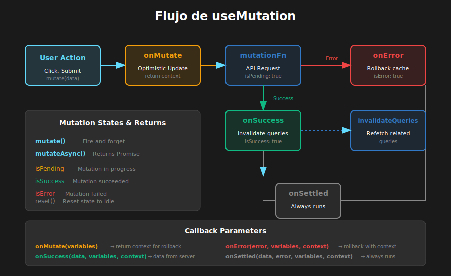

# 📖 Mutations con useMutation

## 🎯 Objetivos de Aprendizaje

- Dominar `useMutation` para operaciones de escritura
- Implementar callbacks: onMutate, onSuccess, onError, onSettled
- Manejar estados de la mutation (isPending, isSuccess, isError)
- Integrar mutations con invalidación de queries
- Tipar correctamente mutations con TypeScript

---

## Visualización del Flujo



---

## 1. ¿Qué es una Mutation?

### 1.1 Queries vs Mutations

```typescript
// QUERIES (useQuery)
// - Operaciones de LECTURA (GET)
// - Se ejecutan automáticamente
// - Cachean datos
// - Refetch automático

// MUTATIONS (useMutation)
// - Operaciones de ESCRITURA (POST, PUT, PATCH, DELETE)
// - Se ejecutan manualmente con mutate()
// - No cachean automáticamente
// - Permiten side effects (invalidar queries, redireccionar, etc.)
```

### 1.2 Anatomía de useMutation

```typescript
import { useMutation } from '@tanstack/react-query';

const {
  mutate, // Función para ejecutar la mutation (fire-and-forget)
  mutateAsync, // Versión async de mutate (retorna Promise)
  data, // Datos retornados por mutationFn
  error, // Error si la mutation falló
  isPending, // true mientras la mutation está en progreso
  isSuccess, // true si la mutation fue exitosa
  isError, // true si la mutation falló
  isIdle, // true si la mutation no ha sido ejecutada
  status, // 'idle' | 'pending' | 'success' | 'error'
  reset, // Función para resetear el estado
} = useMutation({
  mutationFn: (variables) => createUser(variables),
  onMutate: (variables) => {
    /* antes de ejecutar */
  },
  onSuccess: (data, variables, context) => {
    /* si éxito */
  },
  onError: (error, variables, context) => {
    /* si error */
  },
  onSettled: (data, error, variables, context) => {
    /* siempre */
  },
});
```

---

## 2. Creando Mutations

### 2.1 Mutation Básica

```typescript
// src/api/users.ts
export interface CreateUserDTO {
  name: string;
  email: string;
}

export const createUser = async (userData: CreateUserDTO): Promise<User> => {
  const response = await fetch('/api/users', {
    method: 'POST',
    headers: { 'Content-Type': 'application/json' },
    body: JSON.stringify(userData),
  });

  if (!response.ok) {
    throw new Error('Error al crear usuario');
  }

  return response.json();
};
```

```tsx
// src/components/CreateUserForm.tsx
import { useMutation } from '@tanstack/react-query';
import { createUser, CreateUserDTO } from '../api/users';

const CreateUserForm: React.FC = () => {
  const [name, setName] = useState('');
  const [email, setEmail] = useState('');

  const mutation = useMutation({
    mutationFn: createUser,
  });

  const handleSubmit = (e: React.FormEvent) => {
    e.preventDefault();
    mutation.mutate({ name, email });
  };

  return (
    <form onSubmit={handleSubmit}>
      <input
        value={name}
        onChange={(e) => setName(e.target.value)}
        placeholder="Nombre"
        disabled={mutation.isPending}
      />
      <input
        value={email}
        onChange={(e) => setEmail(e.target.value)}
        placeholder="Email"
        disabled={mutation.isPending}
      />

      <button
        type="submit"
        disabled={mutation.isPending}>
        {mutation.isPending ? 'Creando...' : 'Crear Usuario'}
      </button>

      {mutation.isError && <p className="error">{mutation.error.message}</p>}

      {mutation.isSuccess && (
        <p className="success">Usuario creado: {mutation.data.name}</p>
      )}
    </form>
  );
};
```

### 2.2 Tipos de Mutation Functions

```typescript
// Mutation para actualizar
export const updateUser = async ({
  id,
  data,
}: {
  id: number;
  data: Partial<User>;
}): Promise<User> => {
  const response = await fetch(`/api/users/${id}`, {
    method: 'PATCH',
    headers: { 'Content-Type': 'application/json' },
    body: JSON.stringify(data),
  });
  return response.json();
};

// Mutation para eliminar
export const deleteUser = async (id: number): Promise<void> => {
  const response = await fetch(`/api/users/${id}`, {
    method: 'DELETE',
  });

  if (!response.ok) {
    throw new Error('Error al eliminar usuario');
  }
};
```

---

## 3. Callbacks de Mutation

### 3.1 onSuccess

```typescript
const mutation = useMutation({
  mutationFn: createUser,

  // Se ejecuta cuando la mutation es exitosa
  onSuccess: (data, variables, context) => {
    // data: lo que retornó mutationFn
    // variables: lo que se pasó a mutate()
    // context: lo que retornó onMutate (si existe)

    console.log('Usuario creado:', data);

    // Limpiar formulario
    setName('');
    setEmail('');

    // Mostrar notificación
    toast.success('Usuario creado exitosamente');

    // Redireccionar
    navigate(`/users/${data.id}`);
  },
});
```

### 3.2 onError

```typescript
const mutation = useMutation({
  mutationFn: createUser,

  onError: (error, variables, context) => {
    // error: el error lanzado
    // variables: lo que se pasó a mutate()
    // context: lo que retornó onMutate (útil para rollback)

    console.error('Error:', error.message);
    toast.error(`Error: ${error.message}`);

    // Si hay contexto de optimistic update, hacer rollback
    if (context?.previousData) {
      queryClient.setQueryData(['users'], context.previousData);
    }
  },
});
```

### 3.3 onSettled

```typescript
const mutation = useMutation({
  mutationFn: createUser,

  // Se ejecuta siempre, sea éxito o error
  onSettled: (data, error, variables, context) => {
    // Útil para:
    // - Invalidar queries (garantizar datos frescos)
    // - Cerrar modales
    // - Resetear estados

    // Siempre refetch de usuarios, sin importar el resultado
    queryClient.invalidateQueries({ queryKey: ['users'] });
  },
});
```

### 3.4 onMutate (para Optimistic Updates)

```typescript
const mutation = useMutation({
  mutationFn: createUser,

  // Se ejecuta ANTES de la mutation
  // Ideal para optimistic updates
  onMutate: async (newUser) => {
    // Cancelar queries en progreso para evitar race conditions
    await queryClient.cancelQueries({ queryKey: ['users'] });

    // Snapshot del estado actual (para rollback)
    const previousUsers = queryClient.getQueryData(['users']);

    // Optimistic update
    queryClient.setQueryData(['users'], (old: User[] | undefined) => {
      return [...(old || []), { ...newUser, id: Date.now() }];
    });

    // Retornar contexto para onError/onSettled
    return { previousUsers };
  },

  onError: (err, newUser, context) => {
    // Rollback en caso de error
    if (context?.previousUsers) {
      queryClient.setQueryData(['users'], context.previousUsers);
    }
  },

  onSettled: () => {
    // Refetch para sincronizar con servidor
    queryClient.invalidateQueries({ queryKey: ['users'] });
  },
});
```

---

## 4. mutate vs mutateAsync

### 4.1 mutate (Fire and Forget)

```typescript
// mutate: No retorna Promise, maneja estado internamente
const mutation = useMutation({ mutationFn: createUser });

const handleClick = () => {
  // Fire and forget - usa callbacks para manejar resultado
  mutation.mutate(
    { name: 'John', email: 'john@email.com' },
    {
      // Callbacks inline (adicionales a los del hook)
      onSuccess: (data) => {
        console.log('Creado:', data);
      },
      onError: (error) => {
        console.error('Error:', error);
      },
    },
  );
};
```

### 4.2 mutateAsync (con Promise)

```typescript
// mutateAsync: Retorna Promise, para usar con async/await
const mutation = useMutation({ mutationFn: createUser });

const handleClick = async () => {
  try {
    const newUser = await mutation.mutateAsync({
      name: 'John',
      email: 'john@email.com',
    });
    console.log('Usuario creado:', newUser);
    navigate(`/users/${newUser.id}`);
  } catch (error) {
    console.error('Error:', error);
  }
};

// Útil para secuencias de mutations
const handleBulkCreate = async () => {
  try {
    const user1 = await createMutation.mutateAsync({ name: 'User 1' });
    const user2 = await createMutation.mutateAsync({ name: 'User 2' });
    console.log('Ambos creados:', user1, user2);
  } catch (error) {
    // Si alguno falla, se detiene
    console.error('Falló:', error);
  }
};
```

---

## 5. Integración con QueryClient

### 5.1 Invalidación de Queries

```typescript
import { useMutation, useQueryClient } from '@tanstack/react-query';

const CreateUserForm: React.FC = () => {
  const queryClient = useQueryClient();

  const mutation = useMutation({
    mutationFn: createUser,
    onSuccess: () => {
      // Invalidar queries relacionadas
      // Esto marca los datos como "stale" y dispara refetch
      queryClient.invalidateQueries({ queryKey: ['users'] });

      // Invalidar múltiples queries
      queryClient.invalidateQueries({ queryKey: ['users'] });
      queryClient.invalidateQueries({ queryKey: ['stats'] });

      // Invalidar queries que coincidan con patrón
      queryClient.invalidateQueries({
        queryKey: ['users'],
        exact: false, // Invalida ['users'], ['users', 1], etc.
      });
    },
  });

  // ...
};
```

### 5.2 Actualización Manual del Cache

```typescript
const mutation = useMutation({
  mutationFn: updateUser,
  onSuccess: (updatedUser) => {
    // Opción 1: Invalidar y refetch (más seguro)
    queryClient.invalidateQueries({ queryKey: ['users'] });

    // Opción 2: Actualizar cache directamente (más rápido)
    queryClient.setQueryData(['users', updatedUser.id], updatedUser);

    // También actualizar la lista
    queryClient.setQueryData(['users'], (oldUsers: User[] | undefined) => {
      if (!oldUsers) return [updatedUser];
      return oldUsers.map((user) =>
        user.id === updatedUser.id ? updatedUser : user,
      );
    });
  },
});
```

---

## 6. Custom Hooks para Mutations

### 6.1 Patrón Recomendado

```typescript
// src/hooks/useCreateUser.ts
import { useMutation, useQueryClient } from '@tanstack/react-query';
import { createUser, CreateUserDTO, User } from '../api/users';
import { userKeys } from './useUsers';

interface UseCreateUserOptions {
  onSuccess?: (user: User) => void;
  onError?: (error: Error) => void;
}

export const useCreateUser = (options?: UseCreateUserOptions) => {
  const queryClient = useQueryClient();

  return useMutation<User, Error, CreateUserDTO>({
    mutationFn: createUser,
    onSuccess: (data) => {
      // Invalidar lista de usuarios
      queryClient.invalidateQueries({ queryKey: userKeys.lists() });

      // Callback opcional del consumidor
      options?.onSuccess?.(data);
    },
    onError: (error) => {
      options?.onError?.(error);
    },
  });
};
```

```typescript
// src/hooks/useUpdateUser.ts
export const useUpdateUser = () => {
  const queryClient = useQueryClient();

  return useMutation<User, Error, { id: number; data: Partial<User> }>({
    mutationFn: ({ id, data }) => updateUser(id, data),
    onSuccess: (updatedUser) => {
      // Actualizar cache del usuario individual
      queryClient.setQueryData(userKeys.detail(updatedUser.id), updatedUser);

      // Invalidar lista
      queryClient.invalidateQueries({ queryKey: userKeys.lists() });
    },
  });
};
```

```typescript
// src/hooks/useDeleteUser.ts
export const useDeleteUser = () => {
  const queryClient = useQueryClient();

  return useMutation<void, Error, number>({
    mutationFn: deleteUser,
    onSuccess: (_, deletedId) => {
      // Remover del cache
      queryClient.removeQueries({ queryKey: userKeys.detail(deletedId) });

      // Invalidar lista
      queryClient.invalidateQueries({ queryKey: userKeys.lists() });
    },
  });
};
```

### 6.2 Uso de los Custom Hooks

```tsx
// src/components/UserManagement.tsx
import { useUsers } from '../hooks/useUsers';
import { useCreateUser } from '../hooks/useCreateUser';
import { useUpdateUser } from '../hooks/useUpdateUser';
import { useDeleteUser } from '../hooks/useDeleteUser';

const UserManagement: React.FC = () => {
  const { data: users, isLoading } = useUsers();

  const createMutation = useCreateUser({
    onSuccess: (user) => {
      toast.success(`Usuario ${user.name} creado`);
    },
  });

  const updateMutation = useUpdateUser();
  const deleteMutation = useDeleteUser();

  const handleCreate = (data: CreateUserDTO) => {
    createMutation.mutate(data);
  };

  const handleUpdate = (id: number, data: Partial<User>) => {
    updateMutation.mutate({ id, data });
  };

  const handleDelete = (id: number) => {
    if (confirm('¿Eliminar usuario?')) {
      deleteMutation.mutate(id);
    }
  };

  // Verificar si alguna mutation está en progreso
  const isMutating =
    createMutation.isPending ||
    updateMutation.isPending ||
    deleteMutation.isPending;

  return (
    <div>
      <UserForm
        onSubmit={handleCreate}
        isLoading={createMutation.isPending}
      />

      {isLoading ? (
        <Spinner />
      ) : (
        <UserList
          users={users}
          onUpdate={handleUpdate}
          onDelete={handleDelete}
          isDisabled={isMutating}
        />
      )}
    </div>
  );
};
```

---

## 7. Ejemplo Completo: CRUD de Tareas

```typescript
// src/api/tasks.ts
export interface Task {
  id: number;
  title: string;
  completed: boolean;
  createdAt: string;
}

export type CreateTaskDTO = Pick<Task, 'title'>;
export type UpdateTaskDTO = Partial<Pick<Task, 'title' | 'completed'>>;

const API = '/api/tasks';

export const tasksApi = {
  getAll: async (): Promise<Task[]> => {
    const res = await fetch(API);
    return res.json();
  },

  create: async (data: CreateTaskDTO): Promise<Task> => {
    const res = await fetch(API, {
      method: 'POST',
      headers: { 'Content-Type': 'application/json' },
      body: JSON.stringify(data),
    });
    return res.json();
  },

  update: async (id: number, data: UpdateTaskDTO): Promise<Task> => {
    const res = await fetch(`${API}/${id}`, {
      method: 'PATCH',
      headers: { 'Content-Type': 'application/json' },
      body: JSON.stringify(data),
    });
    return res.json();
  },

  delete: async (id: number): Promise<void> => {
    await fetch(`${API}/${id}`, { method: 'DELETE' });
  },
};
```

```typescript
// src/hooks/useTasks.ts
import { useQuery, useMutation, useQueryClient } from '@tanstack/react-query';
import { tasksApi, Task, CreateTaskDTO, UpdateTaskDTO } from '../api/tasks';

const taskKeys = {
  all: ['tasks'] as const,
  list: () => [...taskKeys.all, 'list'] as const,
};

export const useTasks = () => {
  return useQuery<Task[]>({
    queryKey: taskKeys.list(),
    queryFn: tasksApi.getAll,
  });
};

export const useCreateTask = () => {
  const queryClient = useQueryClient();

  return useMutation<Task, Error, CreateTaskDTO>({
    mutationFn: tasksApi.create,
    onSuccess: () => {
      queryClient.invalidateQueries({ queryKey: taskKeys.list() });
    },
  });
};

export const useUpdateTask = () => {
  const queryClient = useQueryClient();

  return useMutation<Task, Error, { id: number; data: UpdateTaskDTO }>({
    mutationFn: ({ id, data }) => tasksApi.update(id, data),
    onSuccess: () => {
      queryClient.invalidateQueries({ queryKey: taskKeys.list() });
    },
  });
};

export const useDeleteTask = () => {
  const queryClient = useQueryClient();

  return useMutation<void, Error, number>({
    mutationFn: tasksApi.delete,
    onSuccess: () => {
      queryClient.invalidateQueries({ queryKey: taskKeys.list() });
    },
  });
};
```

```tsx
// src/components/TaskApp.tsx
const TaskApp: React.FC = () => {
  const { data: tasks, isLoading } = useTasks();
  const createTask = useCreateTask();
  const updateTask = useUpdateTask();
  const deleteTask = useDeleteTask();

  const [newTitle, setNewTitle] = useState('');

  const handleSubmit = (e: React.FormEvent) => {
    e.preventDefault();
    if (newTitle.trim()) {
      createTask.mutate(
        { title: newTitle },
        {
          onSuccess: () => setNewTitle(''),
        },
      );
    }
  };

  const toggleComplete = (task: Task) => {
    updateTask.mutate({
      id: task.id,
      data: { completed: !task.completed },
    });
  };

  if (isLoading) return <Spinner />;

  return (
    <div className="task-app">
      <form onSubmit={handleSubmit}>
        <input
          value={newTitle}
          onChange={(e) => setNewTitle(e.target.value)}
          placeholder="Nueva tarea..."
          disabled={createTask.isPending}
        />
        <button
          type="submit"
          disabled={createTask.isPending}>
          {createTask.isPending ? 'Agregando...' : 'Agregar'}
        </button>
      </form>

      <ul className="task-list">
        {tasks?.map((task) => (
          <li
            key={task.id}
            className={task.completed ? 'completed' : ''}>
            <input
              type="checkbox"
              checked={task.completed}
              onChange={() => toggleComplete(task)}
            />
            <span>{task.title}</span>
            <button
              onClick={() => deleteTask.mutate(task.id)}
              disabled={deleteTask.isPending}>
              🗑️
            </button>
          </li>
        ))}
      </ul>
    </div>
  );
};
```

---

## ✅ Checklist de Verificación

- [ ] Sé usar useMutation para operaciones CRUD
- [ ] Entiendo la diferencia entre mutate y mutateAsync
- [ ] Puedo implementar callbacks (onSuccess, onError, onSettled)
- [ ] Sé invalidar queries después de una mutation
- [ ] Puedo crear custom hooks para mutations
- [ ] Entiendo cómo actualizar el cache manualmente

---

## 📚 Recursos Adicionales

- [useMutation Reference](https://tanstack.com/query/latest/docs/framework/react/reference/useMutation)
- [Mutation Side Effects](https://tanstack.com/query/latest/docs/framework/react/guides/mutations)
- [Invalidation from Mutations](https://tanstack.com/query/latest/docs/framework/react/guides/invalidations-from-mutations)

---

_Siguiente: [04 - Cache e Invalidación](04-cache-invalidation.md)_
