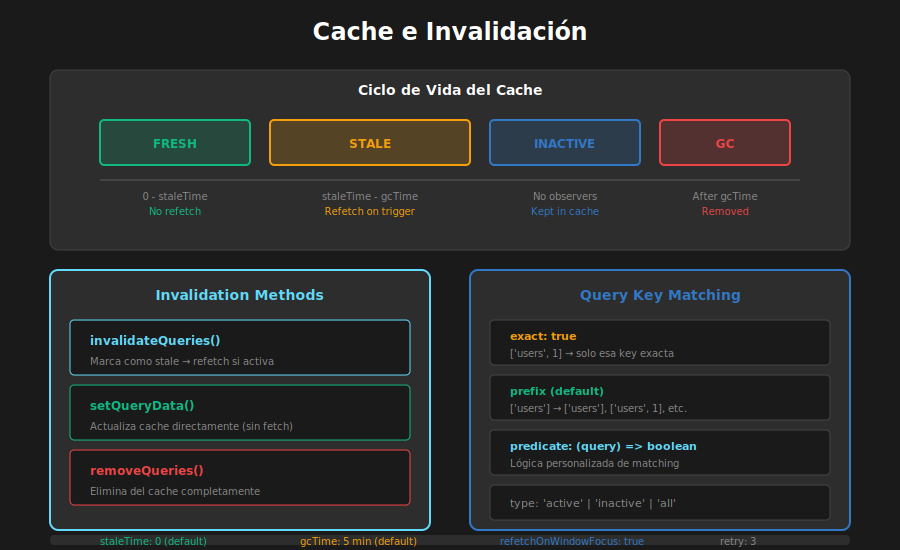

# 📖 Cache e Invalidación

## 🎯 Objetivos de Aprendizaje

- Comprender cómo funciona el sistema de caché de React Query
- Dominar estrategias de invalidación de queries
- Implementar prefetching para mejor UX
- Gestionar el ciclo de vida de los datos en caché
- Configurar staleTime y gcTime correctamente

---

## Visualización de Conceptos



---

## 1. El Sistema de Caché

### 1.1 ¿Cómo Funciona el Caché?

```typescript
// React Query almacena datos en memoria indexados por queryKey

// Cuando haces una query:
useQuery({ queryKey: ['users'], queryFn: fetchUsers });

// Internamente, React Query:
// 1. Busca en caché por la key ['users']
// 2. Si hay datos → los retorna inmediatamente
// 3. Si están stale → hace fetch en background
// 4. Si no hay datos → muestra loading y hace fetch

// El caché es un Map conceptualmente:
// {
//   '["users"]': { data: [...], dataUpdatedAt: 1234567890 },
//   '["users",1]': { data: {...}, dataUpdatedAt: 1234567891 },
//   '["products"]': { data: [...], dataUpdatedAt: 1234567892 },
// }
```

### 1.2 Estados de los Datos

```typescript
// Los datos pueden estar en diferentes estados:

// FRESH (frescos)
// - Dentro del staleTime
// - NO se hace refetch automático
// - Se usan directamente del caché

// STALE (desactualizados)
// - Pasó el staleTime
// - Se retornan del caché PERO se hace refetch en background
// - Patrón "Stale While Revalidate"

// INACTIVE (inactivos)
// - Ningún componente los está usando
// - Permanecen en caché por gcTime
// - Después de gcTime se eliminan (garbage collection)

// FETCHING
// - Actualmente haciendo request al servidor
```

### 1.3 Configuración de Tiempos

```typescript
useQuery({
  queryKey: ['users'],
  queryFn: fetchUsers,

  // staleTime: Cuánto tiempo los datos se consideran frescos
  // Default: 0 (siempre stale)
  staleTime: 1000 * 60 * 5, // 5 minutos

  // gcTime: Cuánto tiempo los datos inactivos permanecen en caché
  // Default: 5 minutos
  // Antes llamado cacheTime
  gcTime: 1000 * 60 * 30, // 30 minutos
});

// Ejemplos de configuración según caso de uso:

// Datos que cambian frecuentemente (ej: precios de acciones)
{ staleTime: 0, gcTime: 1000 * 60 }

// Datos semi-estáticos (ej: lista de categorías)
{ staleTime: 1000 * 60 * 10, gcTime: 1000 * 60 * 60 }

// Datos estáticos (ej: países, monedas)
{ staleTime: Infinity, gcTime: Infinity }

// Datos del usuario actual (refetch solo cuando sea necesario)
{ staleTime: 1000 * 60 * 5, refetchOnWindowFocus: true }
```

---

## 2. Invalidación de Queries

### 2.1 ¿Qué es Invalidar?

```typescript
// Invalidar = Marcar datos como STALE (desactualizados)
// Esto dispara un refetch si la query está activa

import { useQueryClient } from '@tanstack/react-query';

const Component = () => {
  const queryClient = useQueryClient();

  // Invalidar una query específica
  queryClient.invalidateQueries({ queryKey: ['users'] });

  // Cuando invalidas:
  // 1. Los datos se marcan como stale
  // 2. Si hay componentes usando esa query → refetch inmediato
  // 3. Si no hay componentes → refetch cuando se monte uno
};
```

### 2.2 Patrones de Invalidación

```typescript
const queryClient = useQueryClient();

// EXACTA: Solo la query con esa key exacta
queryClient.invalidateQueries({
  queryKey: ['users', 1],
  exact: true,
});
// Invalida: ['users', 1]
// NO invalida: ['users'], ['users', 2], ['users', 1, 'posts']

// PREFIJO (default): Todas las queries que empiecen con esa key
queryClient.invalidateQueries({
  queryKey: ['users'],
});
// Invalida: ['users'], ['users', 1], ['users', { filter: 'active' }]

// CON PREDICADO: Lógica personalizada
queryClient.invalidateQueries({
  predicate: (query) => {
    // Invalidar queries de usuarios activos
    return (
      query.queryKey[0] === 'users' && query.queryKey[1]?.status === 'active'
    );
  },
});

// TODAS las queries
queryClient.invalidateQueries();
```

### 2.3 Invalidación después de Mutations

```typescript
// Patrón más común: invalidar después de crear/actualizar/eliminar

const createUserMutation = useMutation({
  mutationFn: createUser,
  onSuccess: () => {
    // Invalidar la lista de usuarios
    queryClient.invalidateQueries({ queryKey: ['users'] });
  },
});

const updateUserMutation = useMutation({
  mutationFn: updateUser,
  onSuccess: (updatedUser) => {
    // Invalidar la lista Y el usuario específico
    queryClient.invalidateQueries({ queryKey: ['users'] });
    queryClient.invalidateQueries({ queryKey: ['users', updatedUser.id] });
  },
});

const deleteUserMutation = useMutation({
  mutationFn: deleteUser,
  onSuccess: (_, deletedId) => {
    // Invalidar la lista
    queryClient.invalidateQueries({ queryKey: ['users'] });
    // Remover el usuario del caché (ya no existe)
    queryClient.removeQueries({ queryKey: ['users', deletedId] });
  },
});
```

---

## 3. Manipulación Directa del Caché

### 3.1 setQueryData

```typescript
// setQueryData: Actualizar datos en caché sin hacer fetch
// Útil para optimistic updates o cuando tienes los datos nuevos

const queryClient = useQueryClient();

// Setear datos directamente
queryClient.setQueryData(['users', newUser.id], newUser);

// Actualizar datos existentes (con función)
queryClient.setQueryData(['users'], (oldUsers: User[] | undefined) => {
  if (!oldUsers) return [newUser];
  return [...oldUsers, newUser];
});

// Actualizar un item en una lista
queryClient.setQueryData(['users'], (oldUsers: User[] | undefined) => {
  if (!oldUsers) return oldUsers;
  return oldUsers.map((user) =>
    user.id === updatedUser.id ? updatedUser : user,
  );
});

// Remover un item de una lista
queryClient.setQueryData(['users'], (oldUsers: User[] | undefined) => {
  if (!oldUsers) return oldUsers;
  return oldUsers.filter((user) => user.id !== deletedId);
});
```

### 3.2 getQueryData

```typescript
// getQueryData: Leer datos del caché

const users = queryClient.getQueryData<User[]>(['users']);
const user = queryClient.getQueryData<User>(['users', userId]);

// Útil para:
// 1. Verificar si hay datos en caché
if (queryClient.getQueryData(['users'])) {
  console.log('Hay usuarios en caché');
}

// 2. Usar datos existentes como placeholder
useQuery({
  queryKey: ['users', userId],
  queryFn: () => fetchUser(userId),
  placeholderData: () => {
    const users = queryClient.getQueryData<User[]>(['users']);
    return users?.find((u) => u.id === userId);
  },
});
```

### 3.3 removeQueries

```typescript
// removeQueries: Eliminar datos del caché completamente

// Remover queries específicas
queryClient.removeQueries({ queryKey: ['users', deletedUserId] });

// Remover queries inactivas
queryClient.removeQueries({
  queryKey: ['users'],
  type: 'inactive',
});

// Útil al hacer logout
const handleLogout = () => {
  // Limpiar todos los datos del usuario
  queryClient.removeQueries({ queryKey: ['user'] });
  queryClient.removeQueries({ queryKey: ['orders'] });
  // O limpiar todo
  queryClient.clear();
};
```

---

## 4. Prefetching

### 4.1 prefetchQuery

```typescript
// prefetchQuery: Cargar datos antes de que se necesiten
// Mejora la UX cargando datos anticipadamente

const queryClient = useQueryClient();

// Prefetch al hacer hover en un link
const handleMouseEnter = (userId: number) => {
  queryClient.prefetchQuery({
    queryKey: ['users', userId],
    queryFn: () => fetchUser(userId),
    // staleTime para que no se refetch inmediatamente
    staleTime: 1000 * 60 * 5,
  });
};

// En el componente
<Link
  to={`/users/${user.id}`}
  onMouseEnter={() => handleMouseEnter(user.id)}
>
  {user.name}
</Link>
```

### 4.2 Prefetch en Rutas

```typescript
// Prefetch al navegar (con React Router)
import { useNavigate } from 'react-router-dom';

const UserList: React.FC = () => {
  const navigate = useNavigate();
  const queryClient = useQueryClient();

  const handleUserClick = async (userId: number) => {
    // Empezar a cargar los datos
    queryClient.prefetchQuery({
      queryKey: ['users', userId],
      queryFn: () => fetchUser(userId),
    });

    // Navegar inmediatamente (datos se cargan en paralelo)
    navigate(`/users/${userId}`);
  };

  // ...
};
```

### 4.3 Prefetch en Paginación

```typescript
const PaginatedList: React.FC = () => {
  const [page, setPage] = useState(1);
  const queryClient = useQueryClient();

  const { data } = useQuery({
    queryKey: ['items', page],
    queryFn: () => fetchItems(page),
  });

  // Prefetch de la siguiente página
  useEffect(() => {
    if (data?.hasNextPage) {
      queryClient.prefetchQuery({
        queryKey: ['items', page + 1],
        queryFn: () => fetchItems(page + 1),
      });
    }
  }, [data, page, queryClient]);

  return (
    <div>
      {/* Lista de items */}
      <button
        onClick={() => setPage((p) => p + 1)}
        disabled={!data?.hasNextPage}
      >
        Siguiente
      </button>
    </div>
  );
};
```

---

## 5. Query State Management

### 5.1 Refetch Manual

```typescript
const { data, refetch, isFetching } = useQuery({
  queryKey: ['users'],
  queryFn: fetchUsers,
});

// Refetch manual
const handleRefresh = () => {
  refetch();
};

// Refetch con forzar (ignorar staleTime)
const handleForceRefresh = async () => {
  await queryClient.refetchQueries({
    queryKey: ['users'],
    type: 'active', // Solo queries activas
  });
};
```

### 5.2 Cancelación de Queries

```typescript
// cancelQueries: Cancelar queries en progreso

// Útil en optimistic updates para evitar race conditions
const mutation = useMutation({
  mutationFn: updateUser,
  onMutate: async (newData) => {
    // Cancelar queries en progreso
    await queryClient.cancelQueries({ queryKey: ['users'] });

    // Snapshot actual
    const previous = queryClient.getQueryData(['users']);

    // Optimistic update
    queryClient.setQueryData(['users'], (old) => /* update */);

    return { previous };
  },
});

// También útil al desmontar componentes
useEffect(() => {
  return () => {
    queryClient.cancelQueries({ queryKey: ['search', searchTerm] });
  };
}, [searchTerm]);
```

### 5.3 Reset de Queries

```typescript
// resetQueries: Volver al estado inicial

// Resetear a los datos iniciales (si existen)
queryClient.resetQueries({ queryKey: ['users'] });

// Útil para "deshacer" cambios
const handleReset = () => {
  queryClient.resetQueries({ queryKey: ['form-data'] });
};
```

---

## 6. Ejemplo Completo: Gestión de Caché

```typescript
// src/hooks/useProducts.ts
import { useQuery, useMutation, useQueryClient } from '@tanstack/react-query';
import { productsApi, Product } from '../api/products';

// Query Keys Factory
export const productKeys = {
  all: ['products'] as const,
  lists: () => [...productKeys.all, 'list'] as const,
  list: (filters: ProductFilters) => [...productKeys.lists(), filters] as const,
  details: () => [...productKeys.all, 'detail'] as const,
  detail: (id: number) => [...productKeys.details(), id] as const,
};

// Query: Lista de productos
export const useProducts = (filters: ProductFilters = {}) => {
  return useQuery({
    queryKey: productKeys.list(filters),
    queryFn: () => productsApi.getAll(filters),
    staleTime: 1000 * 60 * 2, // 2 minutos
  });
};

// Query: Producto individual
export const useProduct = (id: number) => {
  const queryClient = useQueryClient();

  return useQuery({
    queryKey: productKeys.detail(id),
    queryFn: () => productsApi.getById(id),
    enabled: id > 0,
    // Usar datos de la lista como placeholder
    placeholderData: () => {
      const lists = queryClient.getQueriesData<Product[]>({
        queryKey: productKeys.lists(),
      });

      for (const [, products] of lists) {
        const product = products?.find((p) => p.id === id);
        if (product) return product;
      }
      return undefined;
    },
  });
};

// Mutation: Crear producto
export const useCreateProduct = () => {
  const queryClient = useQueryClient();

  return useMutation({
    mutationFn: productsApi.create,
    onSuccess: (newProduct) => {
      // Opción 1: Agregar directamente al caché
      queryClient.setQueryData(productKeys.detail(newProduct.id), newProduct);

      // Opción 2: Invalidar listas (recomendado)
      queryClient.invalidateQueries({ queryKey: productKeys.lists() });
    },
  });
};

// Mutation: Actualizar producto
export const useUpdateProduct = () => {
  const queryClient = useQueryClient();

  return useMutation({
    mutationFn: ({ id, data }: { id: number; data: Partial<Product> }) =>
      productsApi.update(id, data),
    onSuccess: (updatedProduct) => {
      // Actualizar el detalle en caché
      queryClient.setQueryData(
        productKeys.detail(updatedProduct.id),
        updatedProduct,
      );

      // Invalidar listas
      queryClient.invalidateQueries({ queryKey: productKeys.lists() });
    },
  });
};

// Mutation: Eliminar producto
export const useDeleteProduct = () => {
  const queryClient = useQueryClient();

  return useMutation({
    mutationFn: productsApi.delete,
    onSuccess: (_, deletedId) => {
      // Remover del caché
      queryClient.removeQueries({ queryKey: productKeys.detail(deletedId) });

      // Invalidar listas
      queryClient.invalidateQueries({ queryKey: productKeys.lists() });
    },
  });
};

// Prefetch de producto
export const usePrefetchProduct = () => {
  const queryClient = useQueryClient();

  return (id: number) => {
    queryClient.prefetchQuery({
      queryKey: productKeys.detail(id),
      queryFn: () => productsApi.getById(id),
      staleTime: 1000 * 60 * 5,
    });
  };
};
```

```tsx
// src/components/ProductList.tsx
const ProductList: React.FC = () => {
  const { data: products, isLoading, refetch, isFetching } = useProducts();
  const prefetchProduct = usePrefetchProduct();
  const navigate = useNavigate();

  const handleProductClick = (id: number) => {
    prefetchProduct(id);
    navigate(`/products/${id}`);
  };

  return (
    <div>
      <header>
        <h1>Productos</h1>
        <button
          onClick={() => refetch()}
          disabled={isFetching}>
          {isFetching ? 'Actualizando...' : '🔄 Actualizar'}
        </button>
      </header>

      {isLoading ? (
        <Spinner />
      ) : (
        <ul>
          {products?.map((product) => (
            <li
              key={product.id}
              onClick={() => handleProductClick(product.id)}
              onMouseEnter={() => prefetchProduct(product.id)}>
              {product.name} - ${product.price}
            </li>
          ))}
        </ul>
      )}
    </div>
  );
};
```

---

## ✅ Checklist de Verificación

- [ ] Entiendo la diferencia entre staleTime y gcTime
- [ ] Sé cuándo usar invalidateQueries vs setQueryData
- [ ] Puedo implementar prefetching para mejor UX
- [ ] Entiendo los patrones de invalidación (exact, prefix, predicate)
- [ ] Sé cómo manipular el caché directamente
- [ ] Puedo crear query key factories organizadas

---

## 📚 Recursos Adicionales

- [Caching Examples](https://tanstack.com/query/latest/docs/framework/react/guides/caching)
- [Query Invalidation](https://tanstack.com/query/latest/docs/framework/react/guides/query-invalidation)
- [Prefetching](https://tanstack.com/query/latest/docs/framework/react/guides/prefetching)

---

_Siguiente: [05 - Patrones Avanzados](05-patrones-avanzados.md)_
