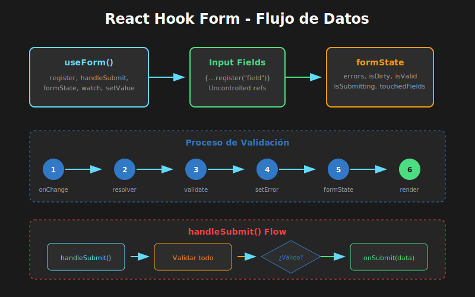

# 01 - Introducción a React Hook Form



## 🎯 Objetivos

- Comprender por qué React Hook Form es la mejor opción para formularios en React
- Entender la diferencia entre formularios controlados y no controlados
- Configurar useForm con TypeScript
- Implementar formularios básicos con register y handleSubmit

---

## 📋 Contenido

### 1. El Problema con los Formularios en React

Los formularios son una de las partes más complejas de cualquier aplicación web. En React tradicional, tenemos dos enfoques:

#### Formularios Controlados (Tradicional)

```tsx
// ❌ PROBLEMA: Re-render en cada keystroke
const ControlledForm: React.FC = () => {
  const [name, setName] = useState('');
  const [email, setEmail] = useState('');
  const [password, setPassword] = useState('');

  // Cada onChange dispara un re-render de TODO el componente
  return (
    <form>
      <input
        value={name}
        onChange={(e) => setName(e.target.value)}
      />
      <input
        value={email}
        onChange={(e) => setEmail(e.target.value)}
      />
      <input
        value={password}
        onChange={(e) => setPassword(e.target.value)}
      />
    </form>
  );
};
```

**Problemas:**

- Re-render en cada tecla presionada
- Estado duplicado (useState por cada campo)
- Validación manual compleja
- Performance degradada en formularios grandes

#### Formularios No Controlados (refs)

```tsx
// ❌ PROBLEMA: Difícil de manejar validación y estado
const UncontrolledForm: React.FC = () => {
  const nameRef = useRef<HTMLInputElement>(null);
  const emailRef = useRef<HTMLInputElement>(null);

  const handleSubmit = (e: React.FormEvent) => {
    e.preventDefault();
    // Acceso manual a valores
    const name = nameRef.current?.value;
    const email = emailRef.current?.value;
  };

  return (
    <form onSubmit={handleSubmit}>
      <input ref={nameRef} />
      <input ref={emailRef} />
    </form>
  );
};
```

**Problemas:**

- Sin validación reactiva
- Difícil mostrar errores
- No hay tracking del estado del formulario

---

### 2. React Hook Form: Lo Mejor de Ambos Mundos

React Hook Form combina la performance de formularios no controlados con la flexibilidad de los controlados.

```tsx
// ✅ SOLUCIÓN: React Hook Form
import { useForm } from 'react-hook-form';

// Definimos la interfaz de nuestros datos
interface LoginFormData {
  email: string;
  password: string;
}

const LoginForm: React.FC = () => {
  // useForm con tipos genéricos
  const {
    register, // Registra inputs
    handleSubmit, // Maneja el submit
    formState: { errors, isSubmitting },
  } = useForm<LoginFormData>();

  // Función tipada que recibe los datos validados
  const onSubmit = (data: LoginFormData) => {
    console.log('Datos del formulario:', data);
  };

  return (
    <form onSubmit={handleSubmit(onSubmit)}>
      <input
        {...register('email')}
        placeholder="Email"
      />

      <input
        {...register('password')}
        type="password"
        placeholder="Contraseña"
      />

      <button
        type="submit"
        disabled={isSubmitting}>
        {isSubmitting ? 'Enviando...' : 'Iniciar Sesión'}
      </button>
    </form>
  );
};
```

**Ventajas:**

- ✅ Mínimos re-renders (usa refs internamente)
- ✅ TypeScript first-class support
- ✅ Validación integrada
- ✅ API simple y declarativa
- ✅ Bundle size pequeño (~8kb)

---

### 3. Configurando useForm

El hook `useForm` acepta un objeto de configuración:

```tsx
interface FormData {
  username: string;
  email: string;
  age: number;
  newsletter: boolean;
}

const MyForm: React.FC = () => {
  const {
    register,
    handleSubmit,
    watch,
    reset,
    setValue,
    getValues,
    formState: {
      errors,
      isDirty,
      isValid,
      isSubmitting,
      isSubmitSuccessful,
      touchedFields,
      dirtyFields,
    },
  } = useForm<FormData>({
    // Valores iniciales del formulario
    defaultValues: {
      username: '',
      email: '',
      age: 18,
      newsletter: false,
    },
    // Modo de validación
    mode: 'onBlur', // 'onSubmit' | 'onBlur' | 'onChange' | 'onTouched' | 'all'
  });

  return (/* ... */);
};
```

#### Modos de Validación

| Modo        | Cuándo valida           | Uso recomendado        |
| ----------- | ----------------------- | ---------------------- |
| `onSubmit`  | Solo al hacer submit    | Formularios simples    |
| `onBlur`    | Al salir de cada campo  | Balance performance/UX |
| `onChange`  | En cada cambio          | Feedback inmediato     |
| `onTouched` | Después del primer blur | UX óptima              |
| `all`       | Blur + Change           | Máxima reactividad     |

---

### 4. El Método register

`register` conecta inputs con React Hook Form:

```tsx
interface ProfileFormData {
  firstName: string;
  lastName: string;
  email: string;
  age: number;
}

const ProfileForm: React.FC = () => {
  const {
    register,
    handleSubmit,
    formState: { errors },
  } = useForm<ProfileFormData>();

  return (
    <form onSubmit={handleSubmit((data) => console.log(data))}>
      {/* Input básico */}
      <input {...register('firstName')} />

      {/* Con validación nativa */}
      <input
        {...register('email', {
          required: 'El email es requerido',
          pattern: {
            value: /^[A-Z0-9._%+-]+@[A-Z0-9.-]+\.[A-Z]{2,}$/i,
            message: 'Email inválido',
          },
        })}
      />
      {errors.email && <span>{errors.email.message}</span>}

      {/* Input numérico con validación */}
      <input
        type="number"
        {...register('age', {
          required: 'La edad es requerida',
          min: {
            value: 18,
            message: 'Debes ser mayor de 18 años',
          },
          max: {
            value: 120,
            message: 'Edad no válida',
          },
          valueAsNumber: true, // Convierte a número
        })}
      />
      {errors.age && <span>{errors.age.message}</span>}

      <button type="submit">Guardar</button>
    </form>
  );
};
```

#### Opciones de register

| Opción          | Tipo                         | Descripción        |
| --------------- | ---------------------------- | ------------------ |
| `required`      | `boolean \| string`          | Campo requerido    |
| `min`           | `number \| {value, message}` | Valor mínimo       |
| `max`           | `number \| {value, message}` | Valor máximo       |
| `minLength`     | `number \| {value, message}` | Longitud mínima    |
| `maxLength`     | `number \| {value, message}` | Longitud máxima    |
| `pattern`       | `RegExp \| {value, message}` | Patrón regex       |
| `validate`      | `function \| object`         | Validación custom  |
| `valueAsNumber` | `boolean`                    | Parsea como número |
| `valueAsDate`   | `boolean`                    | Parsea como fecha  |

---

### 5. formState: Estado del Formulario

`formState` contiene toda la información sobre el estado actual:

```tsx
const FormWithState: React.FC = () => {
  const {
    register,
    handleSubmit,
    formState: {
      errors, // Errores de validación
      isDirty, // ¿Formulario modificado?
      isValid, // ¿Todas las validaciones pasan?
      isSubmitting, // ¿Enviando?
      isSubmitSuccessful, // ¿Submit exitoso?
      submitCount, // Número de submits
      touchedFields, // Campos tocados
      dirtyFields, // Campos modificados
    },
  } = useForm<FormData>({
    mode: 'onChange', // Para que isValid se actualice en tiempo real
  });

  return (
    <form onSubmit={handleSubmit(onSubmit)}>
      <input {...register('email', { required: true })} />

      {/* Mostrar estado del formulario */}
      <div className="form-status">
        <p>Modificado: {isDirty ? 'Sí' : 'No'}</p>
        <p>Válido: {isValid ? 'Sí' : 'No'}</p>
        <p>Intentos de envío: {submitCount}</p>
      </div>

      <button
        type="submit"
        disabled={!isDirty || !isValid || isSubmitting}>
        {isSubmitting ? 'Enviando...' : 'Enviar'}
      </button>
    </form>
  );
};
```

---

### 6. Métodos Útiles

#### watch - Observar valores

```tsx
const WatchExample: React.FC = () => {
  const { register, watch } = useForm<FormData>();

  // Observar un campo específico
  const email = watch('email');

  // Observar múltiples campos
  const [firstName, lastName] = watch(['firstName', 'lastName']);

  // Observar todos los campos
  const allValues = watch();

  return (
    <form>
      <input {...register('email')} />
      <p>Email actual: {email}</p>

      <input {...register('firstName')} />
      <input {...register('lastName')} />
      <p>
        Nombre completo: {firstName} {lastName}
      </p>
    </form>
  );
};
```

#### setValue y getValues - Control programático

```tsx
const ProgrammaticControl: React.FC = () => {
  const { register, setValue, getValues } = useForm<FormData>();

  const fillWithDefaults = () => {
    // Establecer valores programáticamente
    setValue('email', 'default@example.com');
    setValue('firstName', 'Juan', {
      shouldValidate: true,  // Ejecutar validación
      shouldDirty: true,     // Marcar como modificado
    });
  };

  const logCurrentValues = () => {
    // Obtener todos los valores
    const values = getValues();
    console.log(values);

    // Obtener un valor específico
    const email = getValues('email');
    console.log(email);
  };

  return (/* ... */);
};
```

#### reset - Reiniciar formulario

```tsx
const ResetExample: React.FC = () => {
  const { register, handleSubmit, reset } = useForm<FormData>({
    defaultValues: { email: '', password: '' },
  });

  const onSubmit = async (data: FormData) => {
    await saveData(data);
    // Reiniciar después de submit exitoso
    reset();
  };

  const resetToCustomValues = () => {
    // Reiniciar con valores específicos
    reset({
      email: 'nuevo@email.com',
      password: '',
    });
  };

  return (
    <form onSubmit={handleSubmit(onSubmit)}>
      {/* ... inputs ... */}
      <button
        type="button"
        onClick={() => reset()}>
        Limpiar
      </button>
      <button type="submit">Enviar</button>
    </form>
  );
};
```

---

## 📚 Resumen

| Concepto             | Descripción                           |
| -------------------- | ------------------------------------- |
| `useForm<T>()`       | Hook principal, tipado con genéricos  |
| `register`           | Conecta inputs con el formulario      |
| `handleSubmit`       | Wrapper para el submit con validación |
| `formState`          | Estado completo del formulario        |
| `watch`              | Observar valores en tiempo real       |
| `setValue/getValues` | Control programático                  |
| `reset`              | Reiniciar formulario                  |

---

## ✅ Checklist de Verificación

- [ ] Entiendo la diferencia entre formularios controlados y no controlados
- [ ] Puedo configurar useForm con TypeScript
- [ ] Sé usar register con opciones de validación
- [ ] Puedo acceder al estado del formulario con formState
- [ ] Conozco los métodos watch, setValue, getValues y reset

---

## 🔗 Recursos

- [React Hook Form - Documentación Oficial](https://react-hook-form.com/)
- [React Hook Form - TypeScript](https://react-hook-form.com/ts)
- [Comparativa de librerías de formularios](https://react-hook-form.com/faqs#ReactHookFormFormikorReduxForm)
