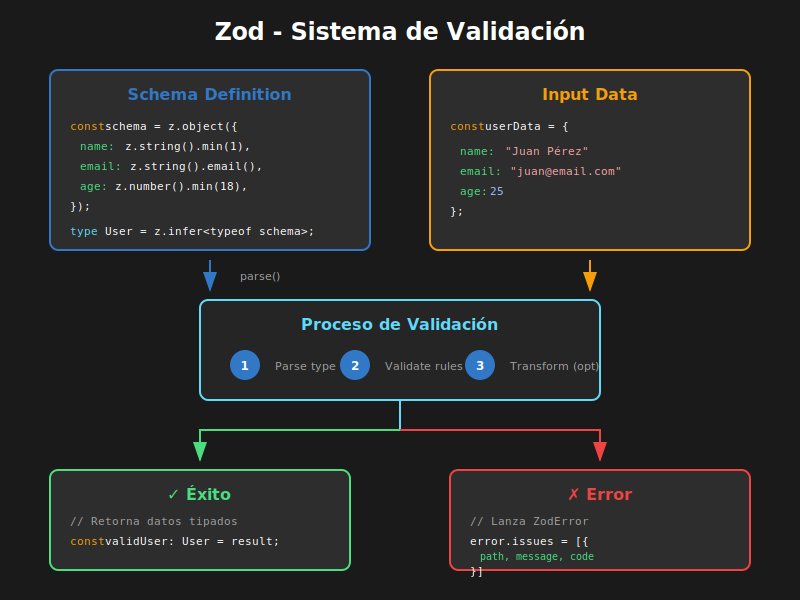

# 02 - Validación con Zod



## 🎯 Objetivos

- Comprender qué es Zod y por qué usarlo para validación
- Crear esquemas de validación con tipos inferidos
- Implementar validaciones complejas con refinements
- Personalizar mensajes de error en español

---

## 📋 Contenido

### 1. ¿Por qué Zod?

Zod es una librería de validación **TypeScript-first** que permite:

- ✅ Definir esquemas de validación
- ✅ Inferir tipos TypeScript automáticamente
- ✅ Validar datos en runtime
- ✅ Transformar datos durante la validación

```tsx
import { z } from 'zod';

// Definimos el esquema UNA VEZ
const userSchema = z.object({
  name: z.string().min(2),
  email: z.string().email(),
  age: z.number().min(18),
});

// TypeScript infiere el tipo automáticamente
type User = z.infer<typeof userSchema>;
// Equivale a:
// type User = {
//   name: string;
//   email: string;
//   age: number;
// }

// Validación en runtime
const result = userSchema.safeParse({
  name: 'Juan',
  email: 'juan@email.com',
  age: 25,
});

if (result.success) {
  console.log(result.data); // Tipado como User
} else {
  console.log(result.error.issues); // Array de errores
}
```

---

### 2. Tipos Primitivos en Zod

```tsx
import { z } from 'zod';

// Strings
const stringSchema = z.string();
const emailSchema = z.string().email();
const urlSchema = z.string().url();
const uuidSchema = z.string().uuid();

// Números
const numberSchema = z.number();
const intSchema = z.number().int();
const positiveSchema = z.number().positive();

// Booleanos
const boolSchema = z.boolean();

// Fechas
const dateSchema = z.date();

// Enums
const roleSchema = z.enum(['admin', 'user', 'guest']);

// Literales
const statusSchema = z.literal('active');

// Nullables y opcionales
const nullableString = z.string().nullable(); // string | null
const optionalString = z.string().optional(); // string | undefined
const nullishString = z.string().nullish(); // string | null | undefined
```

---

### 3. Validaciones de Strings

```tsx
import { z } from 'zod';

const stringValidations = z.object({
  // Longitud
  username: z
    .string()
    .min(3, 'El usuario debe tener al menos 3 caracteres')
    .max(20, 'El usuario no puede exceder 20 caracteres'),

  // Email
  email: z.string().email('Ingresa un email válido'),

  // URL
  website: z.string().url('Ingresa una URL válida').optional(),

  // Regex personalizado
  phone: z.string().regex(/^\+?[1-9]\d{1,14}$/, 'Formato de teléfono inválido'),

  // Transformaciones
  slug: z.string().toLowerCase().trim(),

  // Validación con startsWith/endsWith
  code: z
    .string()
    .startsWith('PRO-', 'El código debe empezar con PRO-')
    .length(8, 'El código debe tener exactamente 8 caracteres'),

  // Includes
  description: z
    .string()
    .min(10, 'La descripción debe tener al menos 10 caracteres'),
});

type StringForm = z.infer<typeof stringValidations>;
```

---

### 4. Validaciones de Números

```tsx
import { z } from 'zod';

const numberValidations = z.object({
  // Rango
  age: z.number().min(18, 'Debes ser mayor de edad').max(120, 'Edad no válida'),

  // Positivo/Negativo
  price: z.number().positive('El precio debe ser positivo'),

  // Enteros
  quantity: z
    .number()
    .int('La cantidad debe ser un número entero')
    .nonnegative('La cantidad no puede ser negativa'),

  // Múltiplos
  discount: z.number().multipleOf(0.01, 'Solo se permiten 2 decimales'),

  // Finito (excluye Infinity)
  rating: z.number().finite().min(0).max(5),
});

type NumberForm = z.infer<typeof numberValidations>;
```

---

### 5. Objetos y Arrays

```tsx
import { z } from 'zod';

// Objetos anidados
const addressSchema = z.object({
  street: z.string().min(1, 'La calle es requerida'),
  city: z.string().min(1, 'La ciudad es requerida'),
  zipCode: z.string().regex(/^\d{5}$/, 'Código postal inválido'),
  country: z.string().default('Colombia'),
});

const userSchema = z.object({
  name: z.string(),
  email: z.string().email(),
  address: addressSchema, // Objeto anidado
});

// Arrays
const tagsSchema = z
  .array(z.string())
  .min(1, 'Agrega al menos una etiqueta')
  .max(5, 'Máximo 5 etiquetas');

// Array de objetos
const itemSchema = z.object({
  id: z.number(),
  name: z.string(),
  quantity: z.number().int().positive(),
});

const cartSchema = z.object({
  items: z.array(itemSchema).min(1, 'El carrito no puede estar vacío'),
  total: z.number().positive(),
});

type Cart = z.infer<typeof cartSchema>;
// {
//   items: { id: number; name: string; quantity: number }[];
//   total: number;
// }
```

---

### 6. Refinements: Validaciones Personalizadas

`refine` permite crear validaciones custom que Zod no provee nativamente:

```tsx
import { z } from 'zod';

// Validación simple con refine
const passwordSchema = z
  .string()
  .min(8, 'Mínimo 8 caracteres')
  .refine((val) => /[A-Z]/.test(val), 'Debe contener al menos una mayúscula')
  .refine((val) => /[0-9]/.test(val), 'Debe contener al menos un número')
  .refine(
    (val) => /[!@#$%^&*]/.test(val),
    'Debe contener al menos un carácter especial',
  );

// Validación que depende de múltiples campos con superRefine
const registerSchema = z
  .object({
    password: z.string().min(8),
    confirmPassword: z.string(),
  })
  .refine((data) => data.password === data.confirmPassword, {
    message: 'Las contraseñas no coinciden',
    path: ['confirmPassword'], // Campo donde mostrar el error
  });

// superRefine para validaciones más complejas
const dateRangeSchema = z
  .object({
    startDate: z.date(),
    endDate: z.date(),
  })
  .superRefine((data, ctx) => {
    if (data.endDate < data.startDate) {
      ctx.addIssue({
        code: z.ZodIssueCode.custom,
        message: 'La fecha de fin debe ser posterior a la de inicio',
        path: ['endDate'],
      });
    }

    // Validación adicional: máximo 30 días de diferencia
    const diffDays = Math.ceil(
      (data.endDate.getTime() - data.startDate.getTime()) /
        (1000 * 60 * 60 * 24),
    );

    if (diffDays > 30) {
      ctx.addIssue({
        code: z.ZodIssueCode.custom,
        message: 'El rango no puede exceder 30 días',
        path: ['endDate'],
      });
    }
  });
```

---

### 7. Transformaciones

Zod puede transformar datos durante la validación:

```tsx
import { z } from 'zod';

const formSchema = z.object({
  // Transformar a minúsculas y eliminar espacios
  email: z.string().email().toLowerCase().trim(),

  // Convertir string a número
  age: z
    .string()
    .transform((val) => parseInt(val, 10))
    .pipe(z.number().min(18)), // Validar después de transformar

  // Convertir string a fecha
  birthDate: z
    .string()
    .transform((val) => new Date(val))
    .pipe(z.date()),

  // Transformación condicional
  phone: z
    .string()
    .transform((val) => val.replace(/\D/g, '')) // Solo dígitos
    .refine((val) => val.length === 10, 'El teléfono debe tener 10 dígitos'),
});

// El tipo de entrada (lo que recibe el formulario)
type FormInput = z.input<typeof formSchema>;
// {
//   email: string;
//   age: string;      // ← string en el input
//   birthDate: string;
//   phone: string;
// }

// El tipo de salida (después de transformar)
type FormOutput = z.output<typeof formSchema>;
// {
//   email: string;
//   age: number;      // ← number después de transform
//   birthDate: Date;
//   phone: string;
// }
```

---

### 8. Uniones y Discriminated Unions

```tsx
import { z } from 'zod';

// Union simple
const idSchema = z.union([z.string(), z.number()]);

// Discriminated union (muy útil para formularios condicionales)
const notificationSchema = z.discriminatedUnion('type', [
  z.object({
    type: z.literal('email'),
    email: z.string().email(),
  }),
  z.object({
    type: z.literal('sms'),
    phone: z.string().min(10),
  }),
  z.object({
    type: z.literal('push'),
    deviceId: z.string().uuid(),
  }),
]);

type Notification = z.infer<typeof notificationSchema>;
// { type: 'email'; email: string }
// | { type: 'sms'; phone: string }
// | { type: 'push'; deviceId: string }

// Validación condicional basada en otro campo
const paymentSchema = z.discriminatedUnion('method', [
  z.object({
    method: z.literal('card'),
    cardNumber: z.string().length(16),
    cvv: z.string().length(3),
    expiry: z.string().regex(/^\d{2}\/\d{2}$/),
  }),
  z.object({
    method: z.literal('transfer'),
    bankAccount: z.string().min(10),
    bankName: z.string(),
  }),
  z.object({
    method: z.literal('cash'),
    // Sin campos adicionales para efectivo
  }),
]);
```

---

### 9. Mensajes de Error Personalizados

```tsx
import { z } from 'zod';

// Mensajes inline
const basicSchema = z.object({
  name: z
    .string({
      required_error: 'El nombre es obligatorio',
      invalid_type_error: 'El nombre debe ser texto',
    })
    .min(2, 'El nombre debe tener al menos 2 caracteres'),

  email: z
    .string({
      required_error: 'El email es obligatorio',
    })
    .email('Ingresa un email válido'),

  age: z
    .number({
      required_error: 'La edad es obligatoria',
      invalid_type_error: 'La edad debe ser un número',
    })
    .min(18, 'Debes ser mayor de 18 años'),
});

// Mapa de errores personalizado global
const customErrorMap: z.ZodErrorMap = (issue, ctx) => {
  if (issue.code === z.ZodIssueCode.invalid_type) {
    if (issue.expected === 'string') {
      return { message: 'Este campo debe ser texto' };
    }
    if (issue.expected === 'number') {
      return { message: 'Este campo debe ser un número' };
    }
  }

  if (issue.code === z.ZodIssueCode.too_small) {
    if (issue.type === 'string') {
      return { message: `Mínimo ${issue.minimum} caracteres` };
    }
    if (issue.type === 'number') {
      return { message: `El valor mínimo es ${issue.minimum}` };
    }
  }

  return { message: ctx.defaultError };
};

// Aplicar globalmente
z.setErrorMap(customErrorMap);
```

---

### 10. Patrones Comunes de Validación

```tsx
import { z } from 'zod';

// Esquema de registro de usuario completo
const registerUserSchema = z
  .object({
    // Información personal
    firstName: z
      .string()
      .min(2, 'El nombre debe tener al menos 2 caracteres')
      .max(50, 'El nombre no puede exceder 50 caracteres'),

    lastName: z
      .string()
      .min(2, 'El apellido debe tener al menos 2 caracteres')
      .max(50, 'El apellido no puede exceder 50 caracteres'),

    email: z.string().email('Ingresa un email válido').toLowerCase(),

    // Contraseña segura
    password: z
      .string()
      .min(8, 'La contraseña debe tener al menos 8 caracteres')
      .regex(/[A-Z]/, 'Debe contener al menos una mayúscula')
      .regex(/[a-z]/, 'Debe contener al menos una minúscula')
      .regex(/[0-9]/, 'Debe contener al menos un número'),

    confirmPassword: z.string(),

    // Fecha de nacimiento (debe ser mayor de edad)
    birthDate: z
      .string()
      .transform((val) => new Date(val))
      .refine((date) => {
        const age = Math.floor(
          (Date.now() - date.getTime()) / (365.25 * 24 * 60 * 60 * 1000),
        );
        return age >= 18;
      }, 'Debes ser mayor de 18 años'),

    // Términos y condiciones
    acceptTerms: z.literal(true, {
      errorMap: () => ({ message: 'Debes aceptar los términos y condiciones' }),
    }),
  })
  .refine((data) => data.password === data.confirmPassword, {
    message: 'Las contraseñas no coinciden',
    path: ['confirmPassword'],
  });

type RegisterUserForm = z.infer<typeof registerUserSchema>;
```

---

## 📚 Resumen

| Concepto                 | Descripción              |
| ------------------------ | ------------------------ |
| `z.object()`             | Esquema para objetos     |
| `z.string()`             | Validación de strings    |
| `z.number()`             | Validación de números    |
| `z.array()`              | Validación de arrays     |
| `z.infer<T>`             | Inferir tipo TypeScript  |
| `.refine()`              | Validación personalizada |
| `.transform()`           | Transformar datos        |
| `z.discriminatedUnion()` | Union discriminada       |

---

## ✅ Checklist de Verificación

- [ ] Puedo crear esquemas Zod para validar objetos
- [ ] Sé inferir tipos TypeScript con z.infer
- [ ] Puedo crear validaciones personalizadas con refine
- [ ] Sé transformar datos durante la validación
- [ ] Puedo personalizar mensajes de error en español

---

## 🔗 Recursos

- [Zod - Documentación Oficial](https://zod.dev/)
- [Zod - Error Handling](https://zod.dev/ERROR_HANDLING)
- [Zod - TypeScript Integration](https://zod.dev/?id=type-inference)
