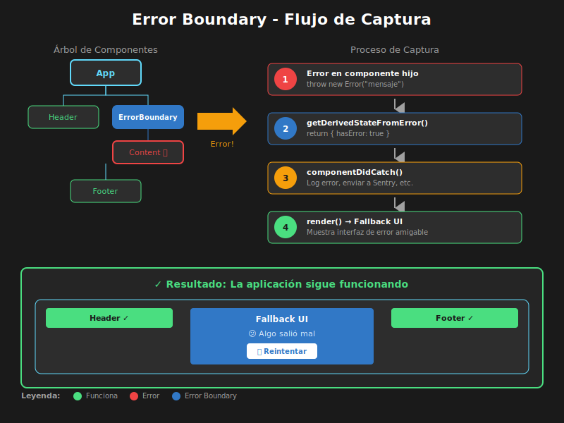

# 05 - Error Boundaries



## 🎯 Objetivos

- Comprender qué son los Error Boundaries y por qué son necesarios
- Implementar Error Boundaries con clases en React
- Crear fallback UI para errores
- Implementar estrategias de recuperación (retry)

---

## 📋 Contenido

### 1. ¿Por qué Error Boundaries?

En JavaScript, los errores en una parte del código no deberían romper toda la aplicación. Sin embargo, en React, un error en un componente puede hacer que toda la UI desaparezca:

```tsx
// ❌ Sin Error Boundary: Un error rompe TODA la app
const BrokenComponent: React.FC = () => {
  // Este error crashea toda la aplicación
  throw new Error('¡Algo salió mal!');
  return <div>Nunca se renderiza</div>;
};

const App: React.FC = () => {
  return (
    <div>
      <Header />
      <BrokenComponent /> {/* Error aquí = pantalla blanca */}
      <Footer />
    </div>
  );
};
```

**Error Boundaries** son componentes que:

- ✅ Capturan errores de JavaScript en su árbol de componentes hijo
- ✅ Muestran una UI de fallback en lugar de crashear
- ✅ Permiten logging de errores
- ✅ Mantienen el resto de la app funcionando

---

### 2. Limitaciones de Error Boundaries

Los Error Boundaries **NO** capturan errores en:

| Escenario                | Solución                             |
| ------------------------ | ------------------------------------ |
| Event handlers           | `try/catch` dentro del handler       |
| Código asíncrono         | `try/catch` o `.catch()` en promesas |
| Server-side rendering    | Manejo de errores del servidor       |
| El propio Error Boundary | Usar múltiples boundaries anidados   |

```tsx
// ❌ Error Boundary NO captura errores en event handlers
const Button: React.FC = () => {
  const handleClick = () => {
    // Este error NO es capturado por Error Boundary
    throw new Error('Error en click');
  };

  return <button onClick={handleClick}>Click me</button>;
};

// ✅ Solución: try/catch en event handlers
const SafeButton: React.FC = () => {
  const handleClick = () => {
    try {
      // Código que puede fallar
      riskyOperation();
    } catch (error) {
      console.error('Error capturado:', error);
      // Mostrar notificación al usuario
    }
  };

  return <button onClick={handleClick}>Click me</button>;
};
```

---

### 3. Implementando un Error Boundary

Los Error Boundaries **deben** ser componentes de clase (por ahora, React no tiene un hook equivalente):

```tsx
import { Component, ErrorInfo, ReactNode } from 'react';

interface ErrorBoundaryProps {
  children: ReactNode;
  fallback?: ReactNode;
  onError?: (error: Error, errorInfo: ErrorInfo) => void;
}

interface ErrorBoundaryState {
  hasError: boolean;
  error: Error | null;
}

class ErrorBoundary extends Component<ErrorBoundaryProps, ErrorBoundaryState> {
  constructor(props: ErrorBoundaryProps) {
    super(props);
    this.state = {
      hasError: false,
      error: null,
    };
  }

  // Método estático para actualizar el estado cuando hay error
  static getDerivedStateFromError(error: Error): ErrorBoundaryState {
    // Actualizar estado para mostrar fallback UI
    return {
      hasError: true,
      error,
    };
  }

  // Método para logging y side effects
  componentDidCatch(error: Error, errorInfo: ErrorInfo): void {
    // Logging del error
    console.error('Error capturado por ErrorBoundary:', error);
    console.error('Component stack:', errorInfo.componentStack);

    // Llamar callback si existe
    this.props.onError?.(error, errorInfo);

    // Aquí podrías enviar el error a un servicio de monitoreo
    // logErrorToService(error, errorInfo);
  }

  render(): ReactNode {
    if (this.state.hasError) {
      // Renderizar fallback UI
      return (
        this.props.fallback || (
          <div className="error-fallback">
            <h2>😕 Algo salió mal</h2>
            <p>Ha ocurrido un error inesperado.</p>
            <details>
              <summary>Detalles del error</summary>
              <pre>{this.state.error?.message}</pre>
            </details>
          </div>
        )
      );
    }

    return this.props.children;
  }
}

export default ErrorBoundary;
```

---

### 4. Usando el Error Boundary

```tsx
import ErrorBoundary from './ErrorBoundary';

// Componente que puede fallar
const UserProfile: React.FC<{ userId: string }> = ({ userId }) => {
  if (!userId) {
    throw new Error('userId es requerido');
  }

  return <div>Perfil del usuario: {userId}</div>;
};

// Aplicación con Error Boundary
const App: React.FC = () => {
  return (
    <div className="app">
      <Header />
      {/* Error Boundary protege esta sección */}
      <ErrorBoundary
        fallback={
          <div className="error-section">
            <p>No se pudo cargar el perfil del usuario.</p>
            <button onClick={() => window.location.reload()}>
              Recargar página
            </button>
          </div>
        }
        onError={(error, info) => {
          // Enviar a servicio de monitoreo
          console.log('Enviando error a servicio:', error.message);
        }}>
        <UserProfile userId="" /> {/* Esto causará un error */}
      </ErrorBoundary>
      <Footer /> {/* Esto sigue funcionando */}
    </div>
  );
};
```

---

### 5. Error Boundary con Retry

Un patrón común es permitir al usuario reintentar:

```tsx
import { Component, ErrorInfo, ReactNode } from 'react';

interface RetryableErrorBoundaryProps {
  children: ReactNode;
  onReset?: () => void;
}

interface RetryableErrorBoundaryState {
  hasError: boolean;
  error: Error | null;
  errorCount: number;
}

class RetryableErrorBoundary extends Component<
  RetryableErrorBoundaryProps,
  RetryableErrorBoundaryState
> {
  constructor(props: RetryableErrorBoundaryProps) {
    super(props);
    this.state = {
      hasError: false,
      error: null,
      errorCount: 0,
    };
  }

  static getDerivedStateFromError(
    error: Error,
  ): Partial<RetryableErrorBoundaryState> {
    return { hasError: true, error };
  }

  componentDidCatch(error: Error, errorInfo: ErrorInfo): void {
    console.error('Error:', error, errorInfo);

    // Incrementar contador de errores
    this.setState((prevState) => ({
      errorCount: prevState.errorCount + 1,
    }));
  }

  // Método para reintentar (resetear el estado)
  handleRetry = (): void => {
    this.setState({
      hasError: false,
      error: null,
    });

    // Callback opcional para limpiar estado externo
    this.props.onReset?.();
  };

  render(): ReactNode {
    const { hasError, error, errorCount } = this.state;
    const maxRetries = 3;

    if (hasError) {
      return (
        <div className="error-boundary-fallback">
          <div className="error-icon">⚠️</div>
          <h2>Ha ocurrido un error</h2>
          <p className="error-message">{error?.message}</p>

          {errorCount < maxRetries ? (
            <>
              <p>
                Intentos: {errorCount} / {maxRetries}
              </p>
              <button
                onClick={this.handleRetry}
                className="retry-button">
                🔄 Reintentar
              </button>
            </>
          ) : (
            <>
              <p>Se han agotado los intentos.</p>
              <button
                onClick={() => window.location.reload()}
                className="reload-button">
                Recargar página
              </button>
            </>
          )}
        </div>
      );
    }

    return this.props.children;
  }
}

export default RetryableErrorBoundary;
```

---

### 6. Error Boundary con Reset por Key

Usar una `key` permite resetear el Error Boundary cuando cambian las props:

```tsx
const UserDashboard: React.FC<{ userId: string }> = ({ userId }) => {
  // Cuando userId cambia, el Error Boundary se resetea automáticamente
  return (
    <ErrorBoundary key={userId}>
      <UserProfile userId={userId} />
      <UserPosts userId={userId} />
      <UserSettings userId={userId} />
    </ErrorBoundary>
  );
};
```

---

### 7. Múltiples Error Boundaries (Granularidad)

Es recomendable tener múltiples Error Boundaries para aislar errores:

```tsx
const App: React.FC = () => {
  return (
    <div className="app">
      {/* Error Boundary de nivel superior */}
      <ErrorBoundary fallback={<FullPageError />}>
        <Header />

        <main className="content">
          {/* Error Boundary para el sidebar */}
          <ErrorBoundary fallback={<SidebarFallback />}>
            <Sidebar />
          </ErrorBoundary>

          {/* Error Boundary para el contenido principal */}
          <ErrorBoundary fallback={<ContentFallback />}>
            <MainContent />
          </ErrorBoundary>
        </main>

        {/* Error Boundary para widgets */}
        <aside>
          <ErrorBoundary fallback={<WidgetFallback />}>
            <WeatherWidget />
          </ErrorBoundary>

          <ErrorBoundary fallback={<WidgetFallback />}>
            <NewsWidget />
          </ErrorBoundary>
        </aside>

        <Footer />
      </ErrorBoundary>
    </div>
  );
};
```

---

### 8. Hook Wrapper para Error Boundaries

Aunque Error Boundaries requieren clases, podemos crear un wrapper funcional:

```tsx
import { Component, ErrorInfo, ReactNode, useCallback, useState } from 'react';

// Props para el componente de clase interno
interface ErrorBoundaryClassProps {
  children: ReactNode;
  onError?: (error: Error, errorInfo: ErrorInfo) => void;
  fallbackRender: (props: {
    error: Error;
    resetError: () => void;
  }) => ReactNode;
  resetKeys?: unknown[];
}

interface ErrorBoundaryClassState {
  hasError: boolean;
  error: Error | null;
}

// Componente de clase interno
class ErrorBoundaryClass extends Component<
  ErrorBoundaryClassProps,
  ErrorBoundaryClassState
> {
  constructor(props: ErrorBoundaryClassProps) {
    super(props);
    this.state = { hasError: false, error: null };
  }

  static getDerivedStateFromError(error: Error): ErrorBoundaryClassState {
    return { hasError: true, error };
  }

  componentDidCatch(error: Error, errorInfo: ErrorInfo): void {
    this.props.onError?.(error, errorInfo);
  }

  componentDidUpdate(prevProps: ErrorBoundaryClassProps): void {
    // Reset cuando cambian las resetKeys
    if (this.state.hasError && prevProps.resetKeys !== this.props.resetKeys) {
      this.reset();
    }
  }

  reset = (): void => {
    this.setState({ hasError: false, error: null });
  };

  render(): ReactNode {
    if (this.state.hasError && this.state.error) {
      return this.props.fallbackRender({
        error: this.state.error,
        resetError: this.reset,
      });
    }
    return this.props.children;
  }
}

// Hook wrapper para uso más ergonómico
interface UseErrorBoundaryReturn {
  ErrorBoundary: React.FC<{
    children: ReactNode;
    fallback?: ReactNode;
  }>;
  reset: () => void;
  error: Error | null;
}

const useErrorBoundary = (): UseErrorBoundaryReturn => {
  const [error, setError] = useState<Error | null>(null);
  const [resetKey, setResetKey] = useState(0);

  const reset = useCallback(() => {
    setError(null);
    setResetKey((k) => k + 1);
  }, []);

  const ErrorBoundaryWrapper: React.FC<{
    children: ReactNode;
    fallback?: ReactNode;
  }> = ({ children, fallback }) => (
    <ErrorBoundaryClass
      resetKeys={[resetKey]}
      onError={(err) => setError(err)}
      fallbackRender={({ error, resetError }) =>
        fallback || (
          <div>
            <p>Error: {error.message}</p>
            <button onClick={resetError}>Reintentar</button>
          </div>
        )
      }>
      {children}
    </ErrorBoundaryClass>
  );

  return { ErrorBoundary: ErrorBoundaryWrapper, reset, error };
};

export { useErrorBoundary };
```

---

### 9. Integrando Error Boundaries con Formularios

Combinación práctica con React Hook Form:

```tsx
import { useForm } from 'react-hook-form';
import { zodResolver } from '@hookform/resolvers/zod';
import { z } from 'zod';
import ErrorBoundary from './ErrorBoundary';

const formSchema = z.object({
  name: z.string().min(1),
  email: z.string().email(),
});

type FormData = z.infer<typeof formSchema>;

const FormContent: React.FC = () => {
  const { register, handleSubmit } = useForm<FormData>({
    resolver: zodResolver(formSchema),
  });

  const onSubmit = async (data: FormData) => {
    // Simular error de red
    const response = await fetch('/api/submit', {
      method: 'POST',
      body: JSON.stringify(data),
    });

    if (!response.ok) {
      throw new Error('Error al enviar el formulario');
    }
  };

  return (
    <form onSubmit={handleSubmit(onSubmit)}>
      <input
        {...register('name')}
        placeholder="Nombre"
      />
      <input
        {...register('email')}
        placeholder="Email"
      />
      <button type="submit">Enviar</button>
    </form>
  );
};

const SafeForm: React.FC = () => {
  return (
    <ErrorBoundary
      fallback={
        <div className="form-error">
          <p>El formulario no está disponible.</p>
          <button onClick={() => window.location.reload()}>Recargar</button>
        </div>
      }>
      <FormContent />
    </ErrorBoundary>
  );
};
```

---

## 📚 Resumen

| Concepto                   | Descripción                            |
| -------------------------- | -------------------------------------- |
| `getDerivedStateFromError` | Actualiza estado cuando hay error      |
| `componentDidCatch`        | Logging y side effects                 |
| Fallback UI                | UI alternativa cuando hay error        |
| Retry pattern              | Permitir al usuario reintentar         |
| Reset por key              | Resetear boundary cuando cambia la key |

---

## ✅ Checklist de Verificación

- [ ] Entiendo qué errores captura un Error Boundary
- [ ] Puedo implementar un Error Boundary con clase
- [ ] Sé crear una UI de fallback apropiada
- [ ] Puedo implementar el patrón retry
- [ ] Sé ubicar Error Boundaries estratégicamente

---

## 🔗 Recursos

- [React Docs - Error Boundaries](https://react.dev/reference/react/Component#catching-rendering-errors-with-an-error-boundary)
- [react-error-boundary](https://github.com/bvaughn/react-error-boundary) (librería popular)
- [Error Handling in React](https://kentcdodds.com/blog/use-react-error-boundary)
